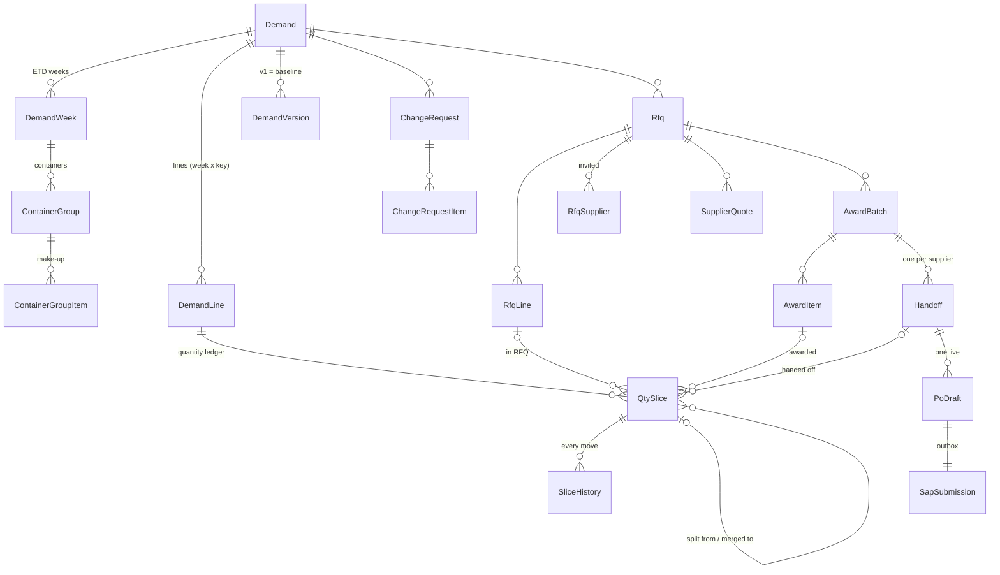

# Database review: structure, relationships and performance (2026-09-26)

**Question:** will users suffer from slow screens once the app holds thousands of demands and years of history?

**Answer:** not because of the database design, after the fixes below. They were measured on a copy with **20,000 demands (~3.8 million workflow rows)**, several times what the business creates in years.
- Every everyday screen now needs **0–160 ms of database time**.
- The remaining risk is **where the application server runs**. Over this PC's VPN, each call to SQL Server takes 130–240 ms, and that, not the database, is what makes screens feel slow here. The production application server must sit in the same data centre as SQL Server.

## 1. How it was measured
| Step | What |
|---|---|
| Real schema inventory | Read from SQL Server's catalog: tables, row counts, keys, 145 foreign keys, every index (`apps/api/scripts/perf/inventory.ts`). |
| A performance database | `supplychain_perf` (never the dev or live database). It has every migration, the SAP master data copied from dev, and **20,000 demands over 3 years**, built set-based in about 100 s (`scripts/perf/build.ts`). Volumes, by table: |
| | — Demand 20,000 · DemandWeek 60,000 · DemandLine 120,000 · ContainerGroupItem 120,000 |
| | — QtySlice 216,000 · SliceHistory 1,167,000 |
| | — Rfq 18,000 · RfqLine 108,000 · SupplierQuote 324,000 · AwardItem 108,000 · Handoff 18,000 |
| | — DomainEvent 400,000 · ThreadEntry 300,000 · InboxItem 200,000 (3 % open) · CommandLog 600,000 |
| The real code | The benchmark (`scripts/perf/bench.ts`) calls the **same functions the screens use**, as a normal one-company user. Per screen it reports wall time, statements sent, **database time** and **pages read** (8 KB each, from `sys.dm_exec_query_stats`). It also runs a write path (create → submit → accept a demand, create an RFQ) and a 20-user concurrency test. |
| Correctness | The new demand status was compared with the old rule for every demand: **0 differences** on 20,000 generated demands and on all 419 dev demands. The full DB test suite passes (**104/104**), including the test that keeps SQL and TypeScript statuses equal. |

## 2. Structure: what is sound
- **Keys:** every table has a primary key and none is a heap. Workflow IDs are `bigint` identities. Quantities are exact `bigint` milli-units, with no floating point.
- **Referential integrity:** 145 foreign keys, and `CHECK` constraints on every state and enum column. There are unique indexes for the business rules: one open handoff per supplier, one live PO draft per handoff, one open work item per object, and one current quote.
- **Tamper-proof history:** comments, versions and attachments can't be changed or deleted (triggers).
- **Concurrency:** `ROWVERSION` columns support optimistic locking, and `UPDLOCK` is used where the code must serialise.
- **The ledger design scales:** a demand's quantity lives in slices with an append-only history. Nothing is recomputed from scratch; the status and reports add slices up.
- **Relationships (core):**



## 3. What was wrong at volume, and what was done
| # | Problem (measured on 20,000 demands) | Effect for users | Fix | After |
|---|---|---|---|---|
| 1 | **RFQs list loaded every RFQ** of the company and paged in memory | Past about 2,000 RFQs it **failed** ("more than 10,000 variables") | Status, filter and paging in SQL; details only for the 50 rows shown (`listRfqs`) | Works; **79 ms** of database time |
| 2 | **Demand status** summed the whole ledger through a view that also built line keys and joined weeks; the Demands list joined it before paging | 140,000–557,000 pages per list call | The status view sums lines and slices directly, from covering indexes. The list computes the status **for the page only**, or as a filter. *(Tried first: indexed views that keep the totals per demand. They made parallel submits queue, see row 9, so they were removed again in 0028.)* | Page 1: **55 ms**; status filter: ~0.2 s at 20,000 demands (was 557,000 pages) |
| 3 | **Every open/close of a My work item scanned the whole inbox** (the filtered index can't be used with a parameter) | Every workflow action slows as history grows (200,000 items: 6,800 pages per update) | `IsOpen = 1` written as a literal; an index on open items only, and one by object | Index seek |
| 4 | **Performance report** recomputed the split time per history row | 4.9 million pages, 11.8 s | Lineage collected once (temporary table); aggregated before the ETD lookup; history index carries trigger and time; **the report opens on the last 3 months** | Quarter: **~1 s** database; all 3 years: 6.3 s (on request) |
| 5 | **Quotes by RFQ:** the only index was filtered on `IsCurrent = 1` | Scan of all quotes on every RFQ and award screen | Unfiltered index `(RfqId, SupplierCode)` | Seek |
| 6 | **Slices by handoff** (accept, return, PO submit, SAP outcome) had no index | Each of these steps scanned the whole ledger | `IX_QtySlice_Handoff`, covering | Seek |
| 7 | **84 foreign keys without an index** | Lookups by those columns scan | Indexes on the ones the app searches by (RFQ line → demand line, award item → RFQ line, SKU allocations, PO items, acknowledgements, SAP attempts, change requests by RFQ, container groups by demand, merge items …). Foreign keys to users stay unindexed on purpose (users are never deleted). | — |
| 8 | Ledger indexes without the columns read | Every status and list looked each slice up again | Covering indexes on the slice (line, RFQ line, award item, handoff, state) and on demand lines | — |
| 9 | **New objects' first history entry took a range lock** (`UPDLOCK, HOLDLOCK` on a thread that doesn't exist yet). Objects created at the same time have neighbouring IDs, so they queued behind each other for the whole transaction. The indexed views of row 2 added more range locks. | 4 demands submitted at once: 4.6 → 10.7 s; worse with more users | Thread created without `HOLDLOCK` (the unique index still allows one per object; a same-moment duplicate is caught and the existing thread read). Indexed views removed (0028). Found with `scripts/perf/contention.ts`, which samples SQL Server's lock waits during parallel writes. | **8 demands submitted at once each take the same time as one alone** |

The changes are migrations **0025** (indexes), **0026** (My work index and status view), 0027 (indexed views) and **0028** (0027 removed again, row 9). The code changes are in `listRfqs`, `listDemands`, `inbox.ts`, `aging.ts`, `companies.ts`, `threads.ts`, the performance report, and the Reports page (3-month default).

## 4. Result per screen (20,000 demands, one-company user)
**Database time** is what users feel with the application server next to SQL Server. **Here** is this PC over the VPN (130–240 ms per call), for comparison only.

| Screen | Statements | Database time | Pages | Here (VPN) |
|---|---|---|---|---|
| My work (tabs · list · search) | 1–2 | 62 · 155 · 220 ms | ≤ 39,000 | ~0.3 s |
| Demands list (page 1 · page 100 · status filter) | 8 | 55 · 72 · 106 ms | ≤ 46,000 | ~1.1 s |
| Demands list: text search (material in any line) | 8 | **531 ms** | 291,000 | 1.3 s |
| Demand page | 13 | **20 ms** | 946 | 1.6 s |
| RFQ builder · shortlist | 3–6 | 0–7 ms | ≤ 1,000 | 0.3–1.0 s |
| RFQs list · RFQ page | 3 · 14 | 79 · 61 ms | ≤ 25,000 | 0.6 · 1.1 s |
| Award grid · award page · handoff panel | 7–13 | 1 · 1 · 28 ms | ≤ 12,000 | 0.5–1.9 s |
| Handoffs · PO drafts · change requests lists | 2 | 0–17 ms | ≤ 6,700 | 0.3 s |
| Handoff page · PO preparation | 4–5 | 0–1 ms | ≤ 114 | 0.6–0.7 s |
| Reports: execution (all · quarter) | 1 | 1,066 · 52 ms | ≤ 3,900 | 1.2 · 0.3 s |
| Reports: CR register (all) | 1 | 1,084 ms | 1,500 | 1.6 s |
| Reports: performance (quarter · all years) | 7 | **971 ms** · 6,274 ms | 674,000 · 805,000 | 1.7 · 7.2 s |
| Operations status | 9 | 4 ms | 177 | 0.6 s |

**Writes** (submit a demand: 5.4 s, accept: 2.7 s, create an RFQ: 3.2 s here) are 13–20 sequential statements in one transaction, so over the VPN they are almost all network. **20 users at once:** the median is 4.2 s here. That is the VPN plus 10 database connections shared by 20 users; the database time of the same calls is about 0.1 s each.

## 5. What is needed so users never wait (recommendations, in order)
1. **Run the application server in the same data centre as SQL Server** (target round trip under 1 ms). This one decision removes 90 % of the time measured on this PC. `docs/operations/production-setup.md` assumes it.
2. **Turn on read-committed snapshot** (`ALTER DATABASE … SET READ_COMMITTED_SNAPSHOT ON`, in a maintenance window). Readers then never wait behind writers: a SAP sync, a long report or a big award. This is the cause found on 2026-09-25, when submits waited 15–20 s behind a materials sync. The code already locks explicitly (`UPDLOCK`, row versions) where it must serialise, so the switch is safe. Test it with the DB suite on a copy first. *(Backlog 17: before production.)*
3. **Raise `DB_POOL_MAX` to 20–30 on the server**, with `UV_THREADPOOL_SIZE` above it (64). There is one pool per API process; 10 connections are few for 50+ users.
4. **Enable Query Store** (SQL Server 2016 has it). It records slow statements in production, so a regression is seen with data, not guesses.
5. **Maintenance:** a weekly index and statistics job (Ola Hallengren's scripts, or a maintenance plan). The fastest-growing tables are `SliceHistory`, `CommandLog`, `DomainEvent`, `ThreadEntry` and closed `InboxItem`s.
6. **Retention:**
   - `CommandLog` (duplicate-command protection) only needs about 30 days: a nightly delete of older rows.
   - Closed `InboxItem`s older than about a year can move to an archive table.
   - History, events and comments are the audit trail: keep them.
7. **Text search:** if searching material names across many demands (0.5 s at 20,000) becomes slow later, add a SQL Server full-text index on the demand lines. Searching by demand number is instant.
8. **Performance report over all years:** if management wants it often, keep a small KPI table per PO-created slice, filled when the PO is created. The report then reads that table instead of walking the ledger (6 s → well under a second).

## 6. Rules added to CLAUDE.md
- Lists page **in SQL** and fetch details for the page only. Never load a whole table to filter or page in memory, and never send an unbounded list of IDs as parameters.
- A **filtered index** (`WHERE IsOpen = 1`, `IsCurrent = 1`) is only used when the query writes that value as a literal, not a parameter.
- **Get-or-create without range locks.** Never `UPDLOCK, HOLDLOCK` on a key that may not exist yet; objects created together would queue. Insert, and treat a duplicate key as "someone else created it" (see `threadSql`).
- **No aggregate indexed views on write-hot tables.** SQL Server maintains them with key-range locks, which serialise concurrent writers.
- A new foreign key the app looks rows up by gets an index. Measure a new heavy screen with `scripts/perf/bench.ts` against `supplychain_perf`.

## 7. How to repeat the measurement
```bash
cd apps/api
npx tsx --env-file-if-exists=../../.env scripts/perf/contention.ts 8     # 8 parallel submits + what SQL Server waits on
npx tsx --env-file-if-exists=../../.env scripts/perf/build.ts 20000   # ~2 min: supplychain_perf with 20,000 demands
npx tsx --env-file-if-exists=../../.env scripts/perf/bench.ts "label"   # per-screen time, database time, pages, top statements
npx tsx --env-file-if-exists=../../.env scripts/perf/checkStatus.ts     # status view = original rule, every demand
```
The `supplychain_perf` database stays on the SQL Server for later runs (about 2.4 GB, simple recovery). Drop it when it is no longer needed.
