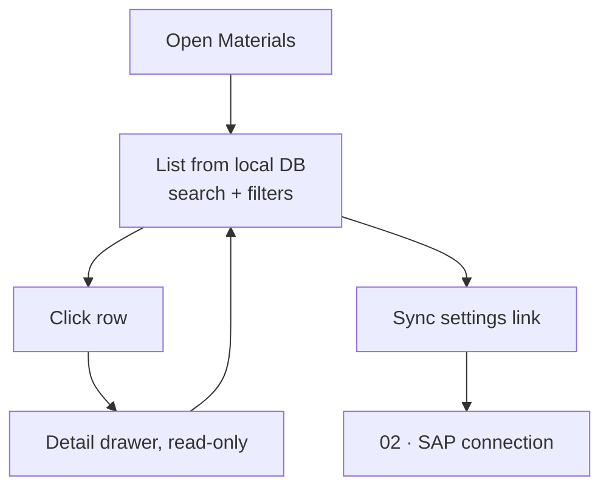

# 01 · Materials

**Status:** Built 2026-09-23. Waiting for user acceptance.

## Purpose
Show the trading/fresh-produce materials from SAP in one searchable, read-only list, organised by **Major category → Sub-major category** (the key hierarchy for building products).

## Users
Anyone who needs to look up a material. Permission: `masterdata.view`.

## Main path
1. The user opens **Master data → Materials**.
2. The table lists materials. The user can search by code or description, and filter by Major category, Sub-major category (narrowed to the chosen Major), Group and Origin.
3. Clicking a row opens a read-only detail drawer.
4. The header shows when the last sync ran, with a link to **Settings → SAP connection**. Syncing is done only on that screen (see [02](02-sap-connection.md)).

## Process flow

## Loose-end check
| Question | Answer |
|---|---|
| Way in / way out | Side menu → Materials; leave through the menu. The drawer closes back to the list. |
| Owner of the data | SAP. This screen never changes data. |
| Failure | If the DB can't be read, an error message is shown in place of the table. |
| Two users at once | Read-only, so there are no conflicts. |
| Material removed in SAP | It stays in the list with a grey **Not in SAP** tag (rule set in 02). |

## Fields
| Column | Table | Drawer |
|---|---|---|
| Material (code) | ✓ | ✓ |
| Description | ✓ | ✓ |
| **Major category** | ✓ | ✓ |
| **Sub-major category** | ✓ | ✓ |
| Material group | hidden by default | ✓ |
| Material type | – | ✓ |
| Base UoM | hidden by default | ✓ |
| Origin | ✓ | ✓ |
| Variety | ✓ | ✓ |
| Size | ✓ | ✓ |
| Weight (SAP has one weight, not net and gross) | ✓ | ✓ |
| Weight unit (column removed 2026-09-23) | – | ✓ |
| **Material class**: description, or code if there is no description (`Class_Name` / `ClassID`) | ✓ | ✓ |
| Status (Active / Not in SAP) | ✓ | ✓ |
| Last synced at | – | ✓ |

## Layout
Compact: font size from Configuration → Appearance, small table rows, 25 / 50 / 100 rows per page and a Columns chooser, both saved per user in the database. The table always fits the page width, with no sideways scrolling. The drawer groups fields as Classification, General, Weights and Produce attributes.

## Out of scope for v1 (moved to the backlog)
- Editing, or fields that exist only in this app
- Export to Excel
- Saved filters or column chooser

## SAP source (confirmed 2026-09-23)
Service `/sap/opu/odata/sap/ZSHR_MARA_CDS/ZSHR_MARA` (OData v2). There are 34,244 materials in total.

| App field | SAP field |
|---|---|
| Material | `MATERAIL` (sic) |
| Description | `Material_Desc` |
| Major category | `Major_Category` + `Major_Category_Desc` |
| Sub-major category | `SubMajor_Category` |
| Material group | `Material_Group` + `Material_Group_Desc` |
| Material type | `Material_Type` |
| Base UoM | `Base_Unit` + `Base_Unit_Name` |
| Origin | `Origin_Name` |
| Variety | `Variety_Name` |
| Size | `Size_Name` |
| Weight / unit | `Weight` + `Weight_Unit` |

Text values are trimmed during sync, because SAP pads some of them (e.g. `"Stone Fruit    "`).

## Which materials are included (decided 2026-09-23)
- Material types chosen in **Configuration → Materials sync** (default **ZTRD**, trading goods), **and**
- Major category is one of: **VEG** Vegetables, **CIT** Citrus, **APL** Apples, **SUF** Sundry Fruit, **STF** Stone Fruit, **GRP** Grapes, **PEA** Pears, **BRE** Berries, **KIW** Kiwifruit, **BAN** Bananas, **PIN** Pineapples.
- **Never** a material whose code starts with a number (decided 2026-09-23; migration 0003 removed the 63 already copied).
- Left out: Others, Miscellaneous, Flowers, Mineral Water, blank category, and every other material type.
- A material that disappears from SAP, or no longer matches this rule, is marked **Not in SAP**. It is never deleted.

## Mockup
v2 (for review): https://claude.ai/artifact/XtvWn9Rp6uM3gx7zQwEe5n
