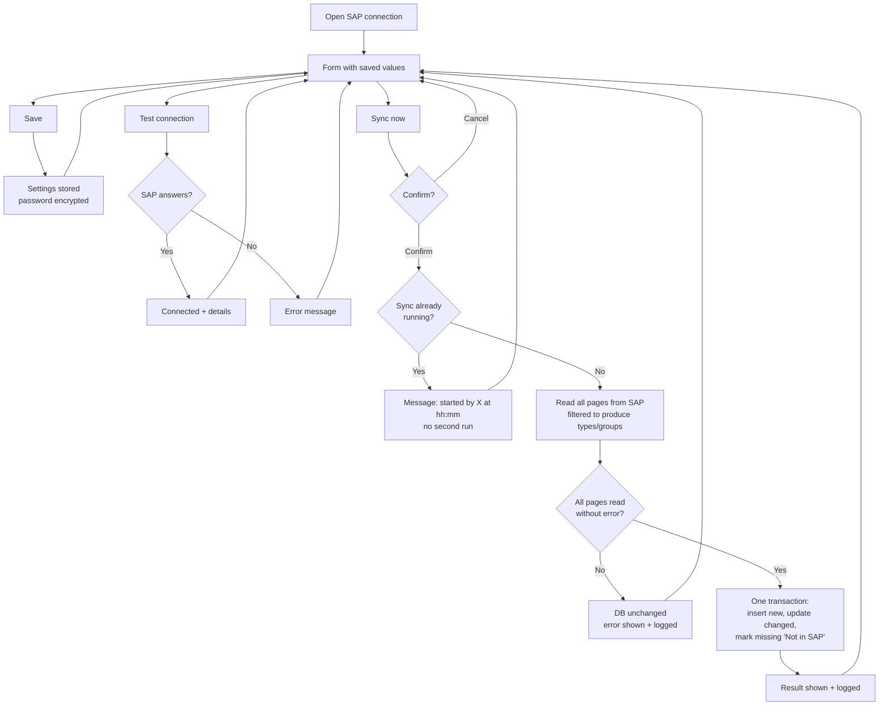

# 02 · SAP connection (Settings)

**Status:** Built 2026-09-23. Waiting for user acceptance.

## Purpose
One place to set up the SAP connection, test it, and copy materials from SAP into the app.

## Users
An administrator. Permissions: `settings.sap.edit` and `masterdata.sync`.

## Main path
1. The user opens **Settings → Configuration** (SAP connection and Materials sync sections).
2. They enter the Base URL, the Materials service path, the SAP client, the user and password, and whether a self-signed certificate is allowed. Then they click **Save**.
3. **Test connection** calls SAP and shows Connected (OData version, response time, row count) or the error.
4. **Sync now**, after a confirmation, copies materials from SAP and shows the result: read, new, updated, not in SAP. The last-sync line is updated.

## Process flow

## Loose-end check
| Question | Answer |
|---|---|
| Way in / way out | Side menu → Settings → SAP connection, or the "Sync settings" link on Materials. |
| Where the settings live | The `app.Setting` table in the new DB. The password is stored encrypted and never sent back to the browser (the field shows `********`). |
| Test or Sync uses unsaved values? | No. Both use the **saved** settings. Save first. |
| SAP unreachable, or error part-way | Every page is read before anything is written. On any error the DB is unchanged and the error is shown and logged. |
| SAP returns only part of the data | Treated as a failure. A partial copy is never saved. |
| Two users click Sync at once | Only one sync runs. The second user sees who started it and when. |
| Material removed in SAP, or no longer matching the include rule | It is not deleted. It is marked **Not in SAP** (confirmed 2026-09-23). |
| Automatic actions | None. Every run is logged: who, when, counts, result. |

## Fields and buttons
- **Connection card:** Base URL\*, Materials service path\*, SAP client, User\*, Password (masked), Allow self-signed certificate. Buttons: **Save**, **Test connection**.
- **Materials sync card:** last sync (time, user), last result, the note "Runs only when someone clicks Sync now". Button: **Sync now** (with confirmation).

## Materials to copy (Materials sync tab)
Lists every SAP material type with its material count (**Load/Refresh list from SAP** reads it, about 5 s). The ticked types are copied by the next sync; default **ZTRD**. At least one type must stay ticked. The major-category rule and the "no codes starting with a number" rule are fixed.

## Out of scope for v1 (moved to the backlog)
- Scheduled or nightly sync
- A screen for the sync history (runs are logged, but there is no screen yet)
- Connections for other SAP services (vendors, customers, stock). Each is added later as its own entry.

## Mockup
v2 (for review): https://claude.ai/artifact/XtvWn9Rp6uM3gx7zQwEe5n. Choose "SAP connection" in the side menu.
