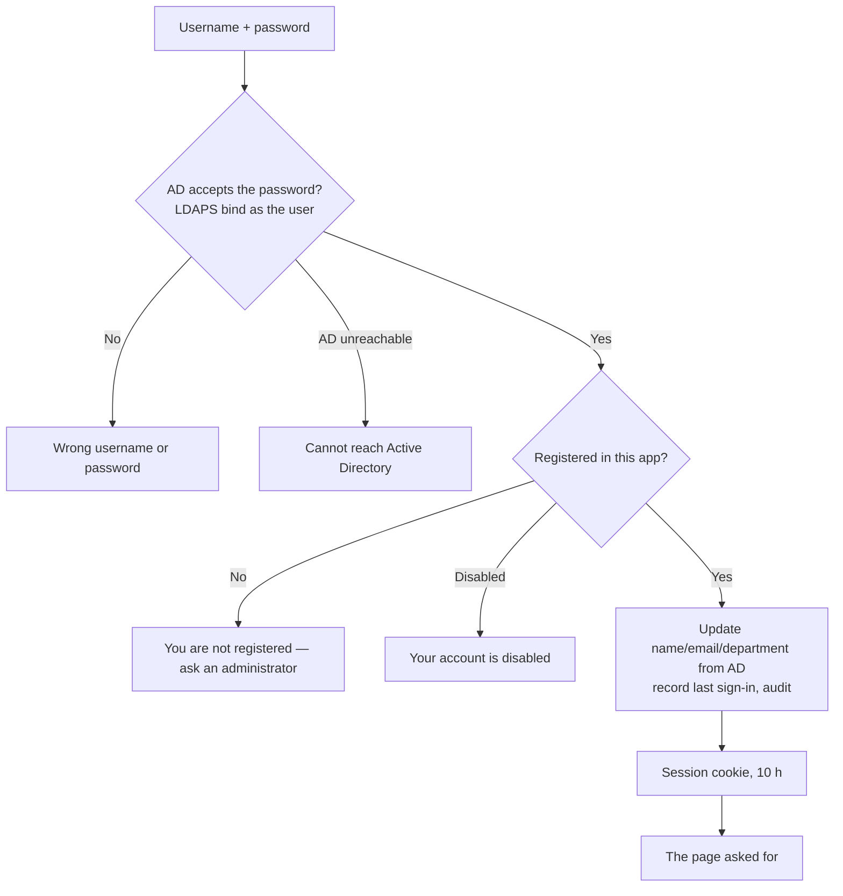

# 05 · Sign-in with Active Directory, and the Active Directory tab

**Status:** Built 2026-09-24. Waiting for user acceptance.

## Sign-in page (`/login`)
- Shows the site icon and name, **Username**, **Password** and **Sign in**.
- Accepted usernames: `mohamed.tag`, `mohamed.tag@sharbatlyfruit.com`, `SHARBATLY\mohamed.tag`. All are normalized to the UPN.
- Every other page sends a signed-out visitor here, and after sign-in the visitor returns to the page they asked for.

## Loose-end check
| Question | Answer |
|---|---|
| Nobody can sign in yet | On first start, `BOOTSTRAP_ADMIN` (.env) is created as Administrator. Signing in needs no search account. |
| AD settings wrong after a save | Sign-in keeps working from the saved values; fix them in the Active Directory tab. Before anything is saved, the `.env` defaults apply. |
| Guessing passwords | 10 attempts per minute per address, then "Too many sign-in attempts". Every failure is audited. AD's own lockout policy still applies. |
| User disabled or role changed while signed in | Takes effect on their next click: the permissions are reloaded on every request. |
| Session ends | Any refused call sends the user back to sign-in. |
| Log out | Header → user name → **Log out**. |

## Configuration → Active Directory tab
- **Fields:** Server URL (`ldaps://192.168.2.19:636`), Base DN, UPN suffix, Allow self-signed cert, and the **search account** (username and password; the password is stored encrypted, and left empty keeps the saved one).
- **Test connection:** signs in with the search account and counts the people under the Base DN.
- **Test login:** checks any username and password against AD and reports the AD details, and whether that person is registered and active. Nothing is stored.
- The search account is used only by the Users page to find people. Today it is the user's own account; a service account should replace it (backlog).
