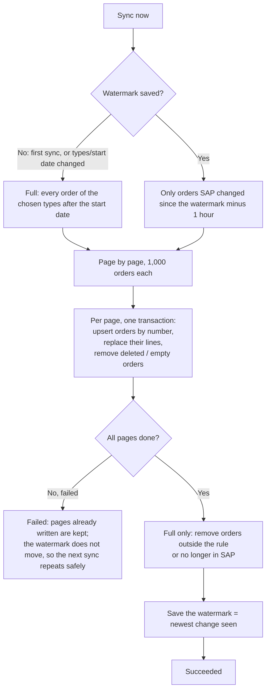

# 09 · Purchase orders (sync + Purchasing → Purchase orders)

**Status:** Built 2026-09-24. Waiting for user acceptance.

## Source
SAP `API_PURCHASEORDER_2` (OData v4). The **data root** is `/sap/opu/odata4/sap/api_purchaseorder_2/srvd_a2x/sap/purchaseorder/0001`. The address given at first (`…/default/iwbep/common/0001/$metadata`) only describes the API and returns no orders. SAP serves at most **5,000 rows per page**.

| App field | SAP |
|---|---|
| PO number, type, supplier, date, currency | `PurchaseOrder`: PurchaseOrder, PurchaseOrderType, Supplier, PurchaseOrderDate, DocumentCurrency |
| Line: item, material, quantity + unit, net price (per price quantity) | `_PurchaseOrderItem`: PurchaseOrderItem, Material, OrderQuantity, PurchaseOrderQuantityUnit, NetPriceAmount, NetPriceQuantity |

## Before the first sync (Configuration → Purchase orders sync)
1. **Load list from SAP**: every order type starting with **Z**, with counts. This reads about 60 pages and takes about a minute. Other types (e.g. NB) are never offered.
2. Tick the order types, pick the **Start date**, and **Save**. Both are required before **Sync now** is enabled.

## Rules
- Only orders of the chosen types dated **on or after the start date**.
- Only **material lines** (with a material) **without a deletion flag**. An order flagged deleted in SAP, or left with no such lines, is removed from the app.

## Sync

- **Pressing Sync again never duplicates.** Orders are keyed by number, lines by (order, item). Each order's lines are replaced as a set, so lines deleted in SAP disappear. Verified: after a full sync of 1,795 orders and 7,327 lines, a changes-only sync and a **Re-sync everything** left the same counts, with 0 duplicate lines.
- **Re-sync everything** ignores the watermark and re-reads everything after the start date.
- Changing the types or the start date clears the watermark, so the next sync is a full one.

## Screen: Purchasing → Purchase orders
- **Columns:** PO number, Type, Date, Supplier, Supplier name (from Suppliers when synced), Lines, Currency.
- **Tools:** search (PO number, supplier code or name), a multi-select Order type filter, and a date range.
- **Details panel:** the order header and its lines. Each line shows the material description when the material is in Materials, the quantity + unit, and the net price + currency (with "/ n" when the price is per n units).

## Loose-end check
| Question | Answer |
|---|---|
| Supplier of an order not synced (group not chosen) | The supplier code is shown with "not in Suppliers". |
| Material not in Materials (e.g. not ZTRD) | The code is shown without a description. |
| An order changes in SAP between syncs | The next changes-only sync picks it up via LastChangeDateTime, with a one-hour overlap. |
| Server stops mid-sync | The run is marked abandoned after 30 minutes; the next sync repeats safely. |

Permissions: `purchaseOrders.open`, `configuration.po.edit`, `configuration.po.run`.
