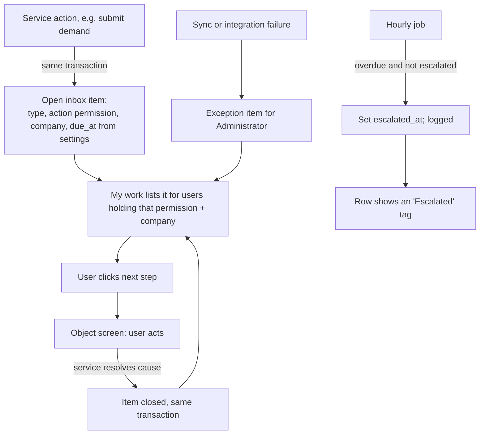

# 10 · My work (home)

**Status:** Accepted 2026-09-24 (Stage 0 of the Demand-to-PO plan v5).

## Purpose
One place that lists everything waiting on the signed-in user, with the next step one click away.

## Users
Everyone with `work.open`. Each person sees only items whose **action permission** they hold (e.g. an "Accept demand" item needs `demand.accept`) and whose **company code** is assigned to them (Configuration → Companies, spec 11).

## Main path
1. After sign-in, the app opens **My work** (`/work`). It replaces Home as the first menu item. Home's database status moves to Configuration → General.
2. The top of the page has one **tab per kind of work**, in business order, each with a count. Tabs with nothing in them are hidden. An **Exceptions** tab is always last and shows red when overdue items exist.
3. Each row is **one item at one step**. It shows:
   - the object number (for example `D-000101`)
   - a short description
   - the company
   - who raised it and when
   - the **due chip**: "Due in 6 h", or red "Overdue 2 d"
   - a **note** saying what is missing
4. The row's main button is the **next step** (for example *Accept demand*). The ⋯ menu lists the other actions the server allows for that item; it appears once an item type has more than one action (from Stage 1). The page never works out actions itself (hard rule 2).
5. Clicking the button opens the object's screen with a **"← Back to My work"** link that returns to the same tab.
6. When the step is done, the item closes on the server. It disappears from the list and the count drops.

## Process flow

## Where items come from
- Items are written **only by the service action that creates the work**, in the same transaction as that action. They are closed only by the action that resolves them. **A user cannot close an item by hand.**
- `category` is **Task** (normal work) or **Exception** (something went wrong: SAP unknown, sync failed, handoff returned, open quantity ageing…).
- `due_at` = creation time + the hours set for that item type in Configuration → Workflow (blank = no due date).
- **Stage 0** creates only Exception items: **sync failures** (materials, suppliers, purchase orders; closed by the next successful run) and **origins to map** (closed when every origin name is mapped), sent to whoever holds the permission to fix them. Each later stage adds its own item types (spec per stage).

## Loose-end check
| Question | Answer |
|---|---|
| Way in / out | Menu **My work** (first item) and the default page after sign-in; out through the row's button or any menu item. |
| Owner | Anyone holding the item's action permission for its company. Items the user can see but not act on are not listed. |
| User has no company assigned | Page shows "You are not assigned to a company yet — ask an administrator". Only system items with no company (e.g. sync failures) are listed, if the user holds their permission. |
| Two users act on the same item | The object's own screen checks its version (409 "changed by someone else, reload"). The item closes once; the second user's list refreshes without it. |
| Item whose object was deleted | Not possible: business records are never deleted, only state changes. |
| Overdue | Red chip, sorted to the top of its tab. The hourly job marks it escalated once, and this is logged in the domain event log. |
| API down | Page shows the standard error and the last loaded list is cleared. |

## Fields and buttons
- **Tabs:** one per item type with open items, plus **Exceptions**. The selected tab is kept in `?tab=`.
- **Filter bar** (collapsed, shared by all tabs): search (number / text), Company (multi-select), Due (Overdue / Due today / Later / No due date).
- **Table** (`AppTable`, key `my-work`): Due, Number, What, Company, Raised by, Raised at, Note (hidden by default), Action. Sorted by overdue first, then due date, then oldest.
- **Side menu badge:** the total count, refreshed every 60 s while the browser tab is visible.

## Out of scope (backlog)
- Email or Teams notifications (plan Stage 9).
- Reassigning an item to a named person.
- A management overview screen for escalations: Stage 0 records `escalated_at` only.

Permissions: `work.open`. Rows are further limited by each item's action permission and the user's companies.

Mockup: `docs/mockups/stage-0.html` (tab "My work").
