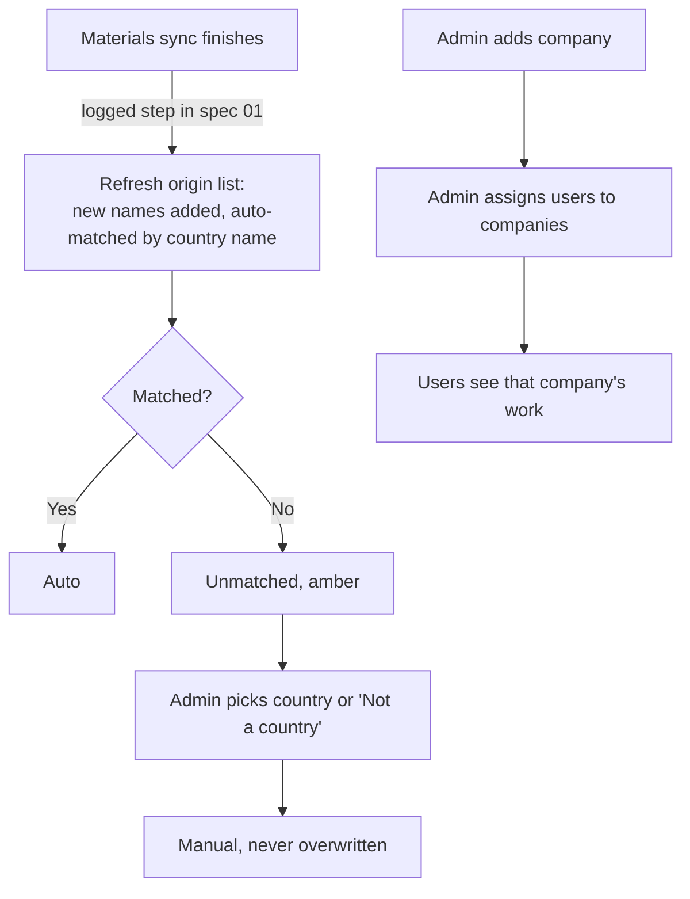

# 11 · Workflow setup (Configuration tabs + user companies)

**Status:** Accepted 2026-09-24 (Stage 0 of the Demand-to-PO plan v5).

## Purpose
Set up the reference data the Demand-to-PO workflow checks against: companies, who works for which company, reason codes, how SAP origins map to countries, and due times.

## Users
Administrators (and anyone given the matching `configuration.workflow.*` permission).

## Main path
1. **Configuration → Companies:** three companies are seeded: **1000 KSA**, **2000 UAE**, **3000 Bahrain**, all with default plant **HO01** (the plant for every material). The administrator fills in each company's **purchasing organization** and purchasing group.
   - In SAP one purchasing organization can buy for several companies (e.g. org 2000 appears on POs of companies 1000 and 3000). So the screen shows a hint with the organizations used in that company's synced POs. Checked 2026-09-24: all 2,532 synced orders (chosen Z types) are company 1000 / org 1000.
   - A company without a purchasing organization cannot have POs built for it (checked from Stage 7).
   - A company can be deactivated, never deleted.
2. **Users → user drawer → Companies:** tick the companies the user works for. Without a company the user sees no workflow data.
3. **Configuration → Reason codes:** each code has a context (Sales CR, Procurement CR, Release, Un-award, Handoff return, SKU change, Proceed without acknowledgement), a description, and whether it **counts against Procurement**. Codes can be deactivated, never deleted. A starter list is seeded.
4. **Configuration → Origins:** this links SAP material origins (names such as "Ecuador") to country codes (such as `EC`), because a supplier's origin is its SAP **Country** code.
   - Every origin name found in Materials is listed.
   - Names are matched automatically by English country name, treating "and" and "&" alike ("Auto"). Checked on 2026-09-24: 92 of the 97 names match.
   - Unmatched names ("USA", "Gulf", "Turkey", "Palestine", blank) are shown first, in amber. You pick a country or mark the name **"Not a country"** (e.g. "Gulf"). Materials with a "Not a country" origin cannot be used on SKU demand lines until it is fixed.
   - A manual choice is never overwritten by the automatic match.
5. **Configuration → Workflow:**
   - due hours per work-item type (blank = no due date)
   - open-quantity ageing alert (weeks before ETD)
   - master-data maximum age in hours (default 26, blocks PO submission when exceeded)
   - purchase history look-back (months, default 36)
   - minimum quantity increment per unit (e.g. CTN = 1)
   - attachment size limit (MB, default 20)

## Process flow

## Loose-end check
| Question | Answer |
|---|---|
| Two admins edit the same company or setting | The row version is checked; the second save gets "changed by someone else, reload". |
| Deactivating a company that has open work | Refused while open workflow records exist (the check is added as later stages create records). |
| Removing a user's last company | Allowed; that user's My work becomes empty. The change is audited. |
| Reason code in use | Can be deactivated (hidden from new choices); history keeps the code. |
| A new origin name appears in SAP | Added by the next materials sync; if unmatched, it is shown amber and an Exception item is raised for Administrators. |
| Audit | Every save writes `app.AuditLog` (`config.workflow.*`, `users.companies`). |

## Supplier and purchase-order sync additions (updates to specs 08 and 09)
- **Suppliers:** the sync also reads from SAP (`A_Supplier` and `to_SupplierPurchasingOrg`) the **blocked** flags (`PurchasingIsBlocked`, `PostingIsBlocked`) and each supplier's **purchasing organizations**, with the per-organization block (`PurchasingIsBlockedForSupplier`). A supplier is *usable for a company* when it is not blocked and is set up in that company's purchasing organization. It is shown on the Suppliers screen as columns **Blocked** and **Purchasing orgs**.
- **Purchase orders:** the sync also reads **CompanyCode**, **PurchasingOrganization** and **PurchasingGroup** from SAP. The first sync after this change is a full one, so existing orders get these values. After every successful sync, a **purchase history summary** is rebuilt, with one row per supplier × company × category × sub-category × size × origin (and per material). It is shown in the run result as "History summary: N rows". It feeds supplier ranking in Stage 4. A failed sync raises an Exception item on My work for Administrators.

## Fields and buttons
- **Companies** (`AppTable`): Code, Name, Country, Time zone, Plant, Purchasing org, Purchasing group, Active, plus a hint "Orgs used in POs". Buttons: **Add company**; clicking a row opens an edit drawer.
- **Reason codes** (`AppTable`): Code, Context, Description, Counts against Procurement, Active. Buttons: **Add**, and an edit drawer.
- **Origins** (`AppTable`): Origin name (SAP), Materials, Country code, Country name, Source (Auto / Manual / Not a country / Unmatched). The row edit uses a country picker. There is a filter **Unmatched only**.
- **Workflow:** a form with the settings above and **Save**.
- **User drawer:** a **Companies** multi-select.

## Out of scope (backlog)
- More than one plant or purchasing org per company.
- Choosing the escalation recipient (for now, escalated items show a tag on My work).

Permissions: `configuration.workflow.companies.edit`, `configuration.workflow.reasons.edit`, `configuration.workflow.origins.edit`, `configuration.workflow.settings.edit`, `users.companies.edit`.

Mockup: `docs/mockups/stage-0.html` (tabs "Companies", "Origins", "Workflow").
