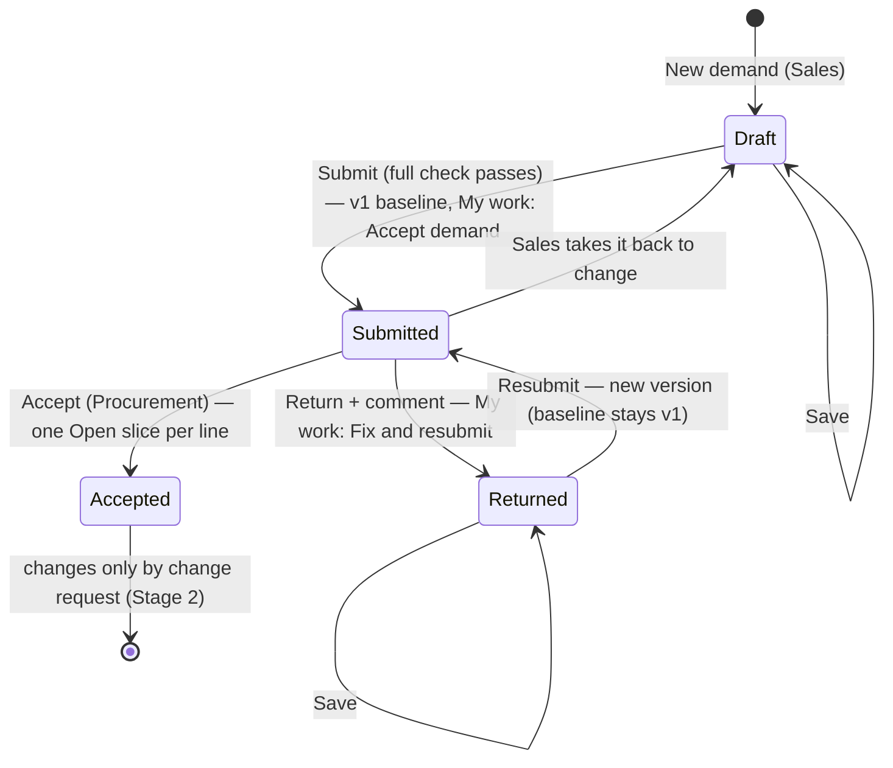

# 12 · Demand (entry and Demand 360)

**Status:** Accepted 2026-09-24 (Stage 1 of the Demand-to-PO plan v5; container groups and composition).

## Purpose
Sales asks for fruit by **ETD week** in **containers**: how many containers, how much each holds, and how each container is shared between materials. The quantity of each material per week follows from that. Procurement accepts or returns the demand. After acceptance the same screen shows where every quantity stands.

## Users
- **Sales** (`demand.create`, `demand.submit`) creates, edits and submits.
- **Procurement** (`demand.accept`, `demand.return`) accepts or returns.
- Everyone with `demands.open` can view, **within their companies**.

## One screen, two modes
`/demands/:id` is **editable** while the demand is *Draft* or *Returned* and the user holds `demand.create`. It is **read-only** otherwise. The buttons shown are the allowed actions the server returns for that demand and user (hard rule 2). `/demands/new` asks for the company and creates a draft.

## Main path
1. **New demand** (from the Demands list): choose the company (only the user's companies). The demand gets its number, e.g. `D-000101`.
2. **Add week**: choose an ETD week from the list, which offers the **current ISO week and the next 52** (for example "2026-W40 · Mon 28 Sep 2026"). Past weeks are never offered, and the server refuses them.
3. **Container groups.** A week holds one or more **groups**. Each group sets three things:
   - **Container group**: a name, e.g. "Mixed Gala". It is optional; the default is "Group 1".
   - **Capacity per container** in one unit, e.g. 1,540 CT.
   - **Number of containers**, e.g. 10.

   **Identical containers are one group, never repeated sections.** For 10 identical containers, set the number to 10. Only containers with a different make-up in the same week get another group (**Add container group**). On save, any identical groups in a week (same capacity, unit, materials and shares) are merged into one and their numbers are added.
4. **Add materials** to a group:
   - Choose Category → Sub-category → **Sizes (several)** → **Classes (several; only those that exist for the sizes)** → Origin → Unit.
   - Every **size × class** combination becomes its own material. For example, 3 sizes × 2 classes = 6 materials.
   - Combinations that SAP does not have are shown as "not in SAP" and skipped.
   - For each combination you can pick an **SKU**. The list offers only materials that match its category, sub-category, size, class, origin and unit. Without an SKU the line stays a specification.
   - Each material gets a **share %** of the container. New materials start with an even split of what is left of 100%.
   - A group has one unit, taken from its first material.
5. **Shares can never exceed 100%.**
   - A share typed above what the other materials leave is capped, with a warning.
   - **Add materials** is disabled when the group is full, and offers only what is left.
   - The server refuses any save above 100%.
   - To submit, shares must total **exactly** 100%. A tag shows the total and what is left.
   - **Whole units only: cartons are never split.**
     - Capacity is a whole number, e.g. 1,540 CT; 1,540.5 is refused.
     - The split is made **per container**: each material gets its share of the capacity rounded down to whole units, and the leftover goes to the largest share, so every container holds exactly its capacity.
     - The group quantity is the per-container quantity × the number of containers. For example, 3 × 1,000 CT at 33.33 / 33.33 / 33.34 % gives 333 / 333 / 334 per container, so 999 / 999 / 1,002 in total.
     - A larger step can be set per unit in Configuration → Workflow.
   - The editor shows the quantity per container and per group.
6. **Copy to week…** copies a group to **another** week. Copying to a week not yet on the demand adds that week. If the target week already has identical containers, their number goes up instead of adding a second group. There is no copy within the same week: raise the number of containers.
7. **Save** at any time. A draft may be incomplete; a group whose shares are not yet 100% gives no quantity until it is complete.
8. **Submit to Procurement.** The full check runs, and every problem is listed at once (see Rules). The first submission is frozen as **version 1 = the KPI baseline**. An *Accept demand* item opens on Procurement's My work.
9. Procurement opens it from My work and chooses:
   - **Accept**: each line gets one *Open* quantity slice holding its full quantity. The demand is now read-only; later changes go through change requests (Stage 2).
   - **Return** with a mandatory comment: back to Sales as *Returned* (a *Fix and resubmit* item on Sales' My work). Sales edits freely and resubmits, which creates a new version. The baseline stays version 1.
   - Until Procurement decides, Sales may **Take back to change…** (optional comment; revision 2026-09-24): the demand is a Draft again, leaves Procurement's *Accept demand* list, and the next submit is a new version. After acceptance, changes go through a change request (spec 14).

## Process flow

## Rules
- **Lines are worked out from the groups** on every save: one line per week × material key. The **key** = category + sub-category + size + **class** + origin + SKU.
  - The same key in two groups of a week is one line, with the quantities added.
  - The same material with a different origin, size, class or SKU is a different line.
- **Week container count** = the sum of its groups' containers.
- **One unit per key per demand.** If a key is ordered in CT in W14, it cannot be ordered in KGM in W15 (`UOM_MISMATCH`).
- **Origin is mandatory.** It is a country code (spec 11). In SKU mode it is the material's origin; a material whose origin is not mapped to a country cannot be chosen.
- **Submit check:**
  - at least one week
  - every week is the current week or later and has at least one group
  - every group has ≥ 1 container, a capacity that is a multiple of the unit's increment, ≥ 1 material, and shares totalling 100%
  - a chosen SKU matches its combination
  - quantities > 0 and a multiple of the unit's increment
  - key and unit rules above
  - SKU materials still in SAP with base unit = line unit
- **After acceptance:** `requested = sum of the line's slices`, always, exactly (invariant 1). The demand's **status** is worked out from the quantities (plan §4.2):
  - *Not started*: everything is still Open
  - *Partially in execution* / *Fully in execution*
  - *Closed fully executed* / *Closed partially executed*
  - *Cancelled*, *Merged*

  At Stage 1 every accepted demand is *Not started*; later stages move the quantities.
- Every action is logged (domain events) and shown in **History**. Submit, return and accept also write an entry to the demand's **Comments**.

## Read-only view (Demand 360)
- **Header:** number, company, status, created by, submitted (first), accepted (by, at), current version.
- **One table per week** (materials are never listed twice). The week header shows its container count and each group, e.g. "Mixed Gala: 2 × 1,540 CT". Per material, one row with:
  - material, size, class, origin and SKU
  - **share** of the container and **cartons per container** (one entry per group when a material is in several groups)
  - **Requested**
  - after acceptance: **Open**, **In progress** (RFQ … PO submitted), **PO created**, **Cancelled**, **Merged out** and the line's **status**; hovering *In progress* shows every slice state
- **Versions:** each version with its reason (Submit, Resubmit, …). **Compare with baseline** shows changed container counts and quantities, highlighted.
- **History:** domain events and slice history, newest first ("5,000 CT created Open — accepted by …").
- **Comments:** the demand's thread. Entries cannot be edited; a correction is a new entry.
- **Attachments:** upload (PDF, images, Excel, Word, email; size limit from spec 11). A new version replaces the current one; old versions stay listed. Every download is logged.

## Loose-end check
| Question | Answer |
|---|---|
| Way in / out | Demands list (13), My work (*Accept demand*, *Fix and resubmit*), direct link. Out via "← Back to My work" or the menu. |
| Owner | Draft/Returned: Sales of that company. Submitted: Procurement of that company. Accepted: change requests (Stage 2). |
| Two people edit the same draft | Each save sends the demand's version; the second save gets "changed by someone else, reload" and nothing is lost silently. |
| Accept and Return pressed at the same time | Only one wins (version check); the other gets 409 and a reload. |
| Double click on Submit / Accept | Commands are duplicate-safe (commandId): one change. |
| A material leaves SAP after being added to a draft | Submit lists it ("material X is no longer in SAP"). The line must be changed. |
| User without the company | The demand is not found (404, nothing disclosed). |
| Company deactivated | New demands cannot use it; existing demands stay readable. |
| Delete a demand | Not possible: business records are never deleted. Discarding unwanted drafts is in the backlog. |

## Fields and buttons
- **Edit mode:**
  - Company (new only), Notes.
  - Weeks: week list (current and future only), total containers, **Add container group**, **Remove week**.
  - Groups: **Container group** (name), **Capacity per container** + unit, **Number of containers**, share total and what is left, **Add materials**, **Copy to week…**, **Remove**.
  - Materials: size, class, origin, SKU (optional), share %, per container, group total, **Remove**.
  - A read-only list of the resulting lines (as last saved).
  - Buttons: **Save** and **Submit to Procurement**.
- **Procurement:** a decision panel on a submitted demand, shown only to users who may decide (`demand.accept` / `demand.return`):
  - **Accept** asks for confirmation and explains its effect: the quantities become open for sourcing, the demand is locked for Sales, and the My work item closes.
  - **Return…** needs a comment. The demand goes back to Sales, who change it and resubmit.
  - Everyone else sees "Waiting for Procurement to accept or return this demand".
- **Tabs:** Lines & quantities · Versions · History · Comments · Attachments.

## Out of scope (backlog)
- Discarding a draft that is not needed.
- Copying a whole demand, and Excel import.
- Saving a container make-up as a reusable template.
- Change requests after acceptance (Stage 2), merge (Stage 3), RFQ (Stage 4).

Permissions: `demands.open`, `demand.create`, `demand.submit`, `demand.accept`, `demand.return`, `demand.comment`, `demand.attach`.

Two editable roles are seeded:
- **Sales:** work, demands, create, submit, comment, attach.
- **Procurement:** work, demands, accept, return, comment, attach.

Users still need a company (spec 11).

Mockup: `docs/mockups/stage-1.html`.
