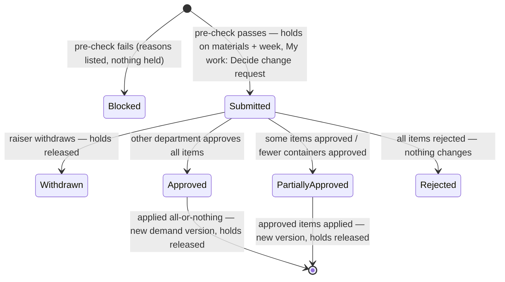

# 14 · Change request (raise and decide)

**Status:** Accepted 2026-09-24 (Stage 2 of the Demand-to-PO plan v5).

## Purpose
After Procurement accepts a demand it is locked. Any change goes through a **change request (CR)**: one department asks, the **other** department decides, and only then does anything change. Every step is recorded.

## Users
- **Sales** raises container changes (`cr.raise.sales`) and decides Procurement's requests (`cr.decide.procurement`).
- **Procurement** raises "not sourced" (`cr.raise.procurement`) and decides Sales' requests (`cr.decide.sales`).
- **Nobody decides a request they raised**, even when they hold both roles.

## What can be requested in Stage 2
| Raised by | Type | What the requester does | Decided by |
|---|---|---|---|
| Sales | **Change containers** | Edits the container groups of the accepted demand in the same editor as a draft. They can change the number of containers of a group, add a group (also in a new week, current or future), remove a group, or change a group's composition (materials or shares). **Cancel week** and **Cancel demand** are shortcuts that remove all groups of a week or of the demand. | Procurement |
| Procurement | **Not sourced** | Picks material lines and the quantity that cannot be sourced; only quantity still *Open* can be picked. Optionally lowers the week's container count. | Sales |

Later stages add Procurement's *Add to demand*, *Week shift* and *Mix change* (Stage 4).

## Main path (Sales: change containers)
1. On an accepted demand, the **Need a change?** panel (below the demand's header) has one button per kind of request, each with a line saying what it does: **Change containers**, **Cancel week** (pick the week), **Cancel whole demand**. Each opens the container editor, which lists the four steps (edit → reason and comment → Check → Send). On a submitted demand not yet accepted, the panel tells Sales to ask Procurement to Return it instead (revision 2026-09-24, after Sales could not find how to ask).
2. Sales makes the changes. The editor highlights them: a changed number of containers, a new group, a removed group, a changed composition.
3. Sales chooses a **reason** (Sales reason codes, spec 11) and writes a **comment**, both mandatory, then presses **Check & send**.
4. **Pre-check.** The server turns the changes into items: one per changed group, each showing the quantity effect per material. It checks the request can be applied:
   - **Reductions** need enough *cancellable* quantity: Open, in RFQ, quoted, awarded, handed off or in PO preparation. Quantity already sent to SAP (PO submitted or created) can never be cancelled.
   - A **composition change** is refused while any quantity of the affected material is awarded or later ("un-award first").
   - The affected materials and week must not already be in another open CR.
   - One unit per material per demand still applies.

   If a check fails, the CR is saved as **Blocked** with the reasons listed, and nothing is held. If it passes, the CR is **Submitted**.
5. **Holds.** While the CR is open:
   - Its week and materials are **on hold**: shown with a badge on the demand, and no other CR can touch them.
   - From later stages, a hold also stops award, handoff and PO submission for those materials.
   - RFQs and quotes can still go on.
6. A **Decide change request** item appears on Procurement's My work, and Sales is notified when it is decided.
7. **Decision.** Procurement opens the CR and decides **each item**:
   - **Approve**, **Reject**, or, for extra containers, **approve fewer** (e.g. 2 of the 3 requested).
   - A decision comment is mandatory.
   - The CR ends **Approved**, **Partially approved** or **Rejected**.
8. **Apply.** This happens in the same step as the decision, all or nothing: if anything fails, nothing changes and the CR stays Submitted.
   - Approved **reductions** cancel quantity least-progressed first: Open, then in RFQ, quoted, awarded, handed off, PO preparation. Cancelled quantity stays on the demand as *Cancelled*, never deleted.
   - If some of it moved on to PO submitted in the meantime, as much as possible is cancelled and the CR shows **Partially applied** with the difference.
   - Approved **additions** add Open quantity with its own clock, and new materials or weeks when needed.
   - The container groups and week container counts are updated, and a new **demand version** (*CR applied*) is saved.
9. The holds are released and the My work item closes.

## Main path (Procurement: not sourced)
1. On an accepted demand, **Need a change? → Not sourced…**: pick lines and quantities (at most their Open quantity), optionally a lower container count for the week, a reason (Procurement codes) and a comment.
2. The same pre-check, holds and My work item follow, but for **Sales** to decide: approve the full quantity, approve less, or reject.
3. The approved quantity is cancelled as **not sourced**, so it counts against Procurement in the KPIs (Stage 8).

## Withdraw
The raiser can **Withdraw** a Submitted CR before it is decided (comment required). Holds are released and nothing changes.

## Process flow

The apply status is shown separately: **Applied**, or **Partially applied** when some approved cancellation had already moved to PO submitted.

## Loose-end check
| Question | Answer |
|---|---|
| Way in / out | Demand screen → **Need a change?** panel; My work → *Decide change request*; Change requests list (spec 15). |
| Owner | The raiser until it is sent; then the other department until the decision. |
| Two CRs on the same materials or week | The second is **Blocked** ("already in CR-000012"). |
| Decider is the raiser (holds both roles) | Refused ("you cannot decide a change request you raised"). The database also refuses it. |
| Two deciders at once | The CR's version is checked: the second gets 409 and a reload. A double click applies once. |
| Quantity moved on while the CR waited | Checked again when it is applied. A shortfall in a cancellation becomes *Partially applied*; any other failure means nothing is applied, and the decider sees why. |
| Demand not accepted yet | No CR: edit the draft or return it instead. |
| Everything cancelled | The demand's status becomes *Cancelled* (derived from quantities, spec 12). |

## Fields and buttons
- **Demand screen:**
  - **Need a change?** panel (Sales: *Change containers*, *Cancel week*, *Cancel whole demand*; Procurement: *Not sourced…*); on a submitted demand, a note for Sales on how to change it before acceptance
  - **On hold** badges on held weeks and materials, linking to the CR
  - the CRs of this demand listed in a new **Change requests** tab
- **CR screen** (`/change-requests/:id`):
  - Header: number (`CR-000012`), type, demand, raised by / at, reason, comment, status, apply status.
  - Items: what changes (before → after), the quantity effect per material, and the quantity at submit and now.
  - Decision column per item (for the decider).
  - Decision comment, **Decide**, **Withdraw** (for the raiser).
  - Tabs: Comments · Attachments · History.

## Out of scope (backlog / later stages)
- *Add to demand*, *Week shift* and *Mix change* (Procurement, Stage 4).
- Changing a material's specification on quantity that is already awarded (un-award first, Stage 5).
- Changes after a PO is submitted to SAP (plan Stage 9).

Permissions: `crs.open` (list and view), `cr.raise.sales`, `cr.raise.procurement`, `cr.decide.sales`, `cr.decide.procurement`, `cr.withdraw` (own only). The seeded roles get them:
- **Sales:** `crs.open`, `cr.raise.sales`, `cr.decide.procurement`, `cr.withdraw`
- **Procurement:** `crs.open`, `cr.raise.procurement`, `cr.decide.sales`, `cr.withdraw`

Mockup: `docs/mockups/stage-2.html`.
