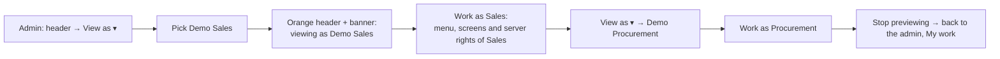

# 16 · View as (test the app as another department)

**Status:** Accepted 2026-09-24. Asked for by the user to test the app as other roles; approach chosen: demo accounts (not role-only preview), so that "the raiser never decides" can be tested end to end.

## Purpose
An administrator switches the whole app into a **demo account** — Demo Sales, Demo Procurement, Demo Sales + Procurement — to see and do exactly what that department sees and does, then switches back. Each demo account is a separate user, so a change request raised as Demo Sales can be decided as Demo Procurement.

## Users
Administrators only, and only where `ALLOW_VIEW_AS=true` (`.env`; set to `false` on the live server).

## Main path

## Loose-end check
- **Server-side, not cosmetic:** while viewing, every request is made as the demo user (its roles and companies); the admin's rights do not apply.
- **Who did it:** records show the demo account (e.g. "Raised by Demo Sales"). The audit log records `viewAs.start` / `viewAs.stop` under the administrator.
- **Safety:** demo accounts cannot sign in with a password; a View as session is honoured only while `ALLOW_VIEW_AS` is on, the administrator is still an active admin and the target is still an active demo account — otherwise it falls back to the administrator (or is refused).
- **Changing a demo account:** its roles and companies are edited on Users like any user (shown with a *Demo* tag). Seeded by migration 0013 with every company.
- Log out while viewing ends the session as usual.

## Fields and buttons
| Where | What |
|---|---|
| Header | **View as ▾** (eye icon): the demo accounts with their roles and companies; **Stop previewing (back to …)** while viewing. While viewing the header is orange and reads *View as: Demo …*. |
| Every page, while viewing | Warning banner "You are viewing the app as Demo … Everything you do now is recorded as Demo …" with **Stop previewing**. |
| Users | *Demo* tag next to demo usernames. |

After each switch the app reloads everything and opens My work.

## Out of scope
- Viewing as a real (non-demo) person.
- Creating demo accounts from the screen (add rows via migration or register and flag later if needed).
