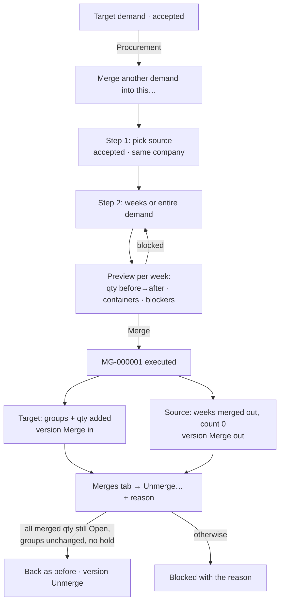

# 17 · Merge and unmerge demands

**Status:** Accepted 2026-09-24 (Stage 3 of the Demand-to-PO plan v5).

## Purpose
Procurement combines demands so they are sourced together: one or more ETD weeks — or a whole demand — are moved from a **source** demand into a **target** demand of the same company. In each week, the quantities of the same material (same key, origin included) are added to the target's line, and the source week's **container groups move into the target week**. The merged quantity is one pool (no priority), but every quantity keeps where it came from: its business origin (Sales / Procurement / Change), its original demand and line, and its clock (first submission). A merge can be undone (**unmerge**) as long as nothing has happened to the merged quantity.

## Users
- **Procurement** (`demand.merge`, `demand.unmerge`), for demands of their companies.
- **Sales** sees merges on both demands (read-only): where quantity went and where it came from.

## Main path — merge
1. On the **target** demand (accepted), the Procurement panel shows **Merge another demand into this…**.
2. **Step 1 · Source:** a list of the other accepted demands of the same company (number, created by, weeks, containers, open quantity). Pick one.
3. **Step 2 · What:** the source's weeks, each with its containers and quantity; tick weeks, or **Entire demand**. Weeks not mergeable are shown greyed with the reason.
4. **Preview** (from the server, per week): per material, target quantity before → after; containers before → after; the groups that will move; anything blocking, with its reason. A comment is optional.
5. **Merge** (confirm dialog). Result: merge **MG-000001**; both demands get a new version (*Merge in* / *Merge out*), a Comments entry and a line on their **Merges** tab.

## Main path — unmerge
1. On either demand, **Merges** tab → the merge → **Unmerge…** (reason required).
2. Everything goes back: the source quantities are Open again, the merged-in quantities become *Merged out* (neutral), the container groups return to the source week. Both demands get a new version (*Unmerge*).

## Rules
| Rule | Detail |
|---|---|
| Who / which | Procurement only; both demands **accepted**, same **company code**, source ≠ target. |
| Quantity must be free | In the selected source weeks, all quantity that is not final must be **Open** (Stage 4 adds RFQ; quantity in an RFQ then blocks merge). |
| Holds | No change-request hold on the source weeks/lines, nor on the target week (it would change under a pending decision). |
| Same week | A source week goes into the **same ETD week** of the target (created if missing). Moving it to another week afterwards is a change request. |
| Key and unit | Same key (category · sub-category · size · class · origin · SKU) → added to the target line; a new key → a new line. A key whose unit differs from the target's unit for that key blocks the merge (*unit mismatch*). |
| Containers | The source week's active container groups move to the target week, keeping name, capacity and make-up, labelled *from D-000118 · MG-000001*; the target week's count grows by the moved count, the source week's becomes 0. Identical groups are **not** combined, so they can move back. |
| Ledger | Source Open quantity → *Merged out* (to the target); the target line gets new Open quantity with *arrived via merge*, the same business origin, original demand/line and clock. Totals across the company never change (nothing counted twice). |
| Chains | Quantity merged into B may be merged again into C. Undo in reverse order: C's merge first; B's is blocked until then. |
| Unmerge allowed while | every merged-in quantity (and anything split from it) is still Open; no hold on the target lines/weeks; the moved groups are unchanged (a change request that changed or removed a merged-in group blocks unmerge — use a change request instead). |
| Status | A source whose quantity is all merged out shows **Merged**. |
| Never deleted | Merge and unmerge are state changes with history; the merge record stays (status *Executed* / *Unmerged*). |

## Process flow

## Loose-end check
| Case | Outcome |
|---|---|
| Source or target not accepted / other company | Not offered in step 1; the server refuses too (`BAD_STATE`, `COMPANY_MISMATCH`). |
| Source week has a pending change request | Week greyed: "On hold in CR-000012". |
| Target week has a pending change request | Week greyed: "Target week on hold in CR-000012". |
| Unit differs for a key | Week greyed with the key and both units. |
| Source week already fully merged out / cancelled | Not listed (nothing Open). |
| Two people merge / unmerge at the same time | Version check: the second gets "changed meanwhile — reload". Demands locked in id order (no deadlock). |
| Merged-in group later reduced by a change request | Unmerge blocked: "Group Gala from D-000118 was changed by CR-000020". |
| A → B → C, then unmerge A → B | Blocked: "Quantity was merged onward in MG-000003 — unmerge that first". |
| Sales raises a change request on the target | Works on the whole week pool, merged-in groups included (they are the target's groups now). |
| Notifications | Comments entry on both demands; creators of both are queued in the notification outbox (delivery: plan Stage 9). No new My work item. |

## Fields and buttons
- **Demand screen (Procurement, accepted demand):** panel **Procurement** with *Not sourced…* (Stage 2) and **Merge another demand into this…**.
- **Merge wizard** (`/demands/:id/merge`): step 1 table (Demand, Created by, Weeks, Containers, Open); step 2 week checkboxes + **Entire demand**; the preview updates as weeks are ticked (no separate Check; the server checks everything again on Merge): preview table (Week, Material, Target now, Adds, Target after; containers row) and blockers; optional comment; **Merge** (confirm).
- **Week cards:** a merged-in group shows the tag *from D-000118 · MG-000001*; a source week shows *Merged into D-000101 · MG-000001* and 0 containers.
- **Merges tab** (both demands): Merge no · Direction (in / out) · Other demand · Weeks · Containers · Quantity · By / at · Status (*Executed* / *Unmerged*) · **Unmerge…** (Procurement, when allowed; otherwise the reason as a tooltip).
- **Versions / History / Comments:** *Merge in*, *Merge out*, *Unmerge* entries.
- **Invariants added:** 14 (merge lineage: every merged-in quantity points to merged-out quantity with the same business origin) and 16 (a merge never mixes company codes); plus: a merge's moved containers equal the groups it moved.

## Out of scope (later)
- Merging quantity that is in an RFQ, and releasing it on unmerge (Stage 4).
- A company-wide list of merges (backlog); merges are listed on each demand.
- Merging into a different week (use a change request after the merge).
