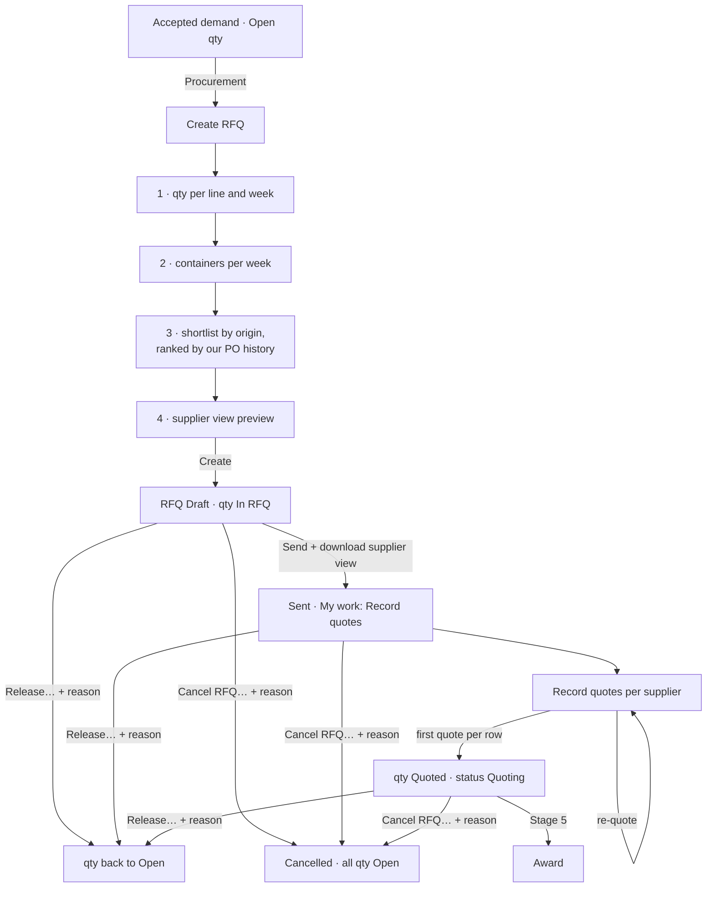

# 18 · RFQs: build, supplier view, quotes, release (Stage 4a)

**Status:** Accepted 2026-09-24 (Stage 4a of the Demand-to-PO plan v5; 4b = Procurement change requests: add quantity, week shift, mix change).

## Purpose
Procurement asks suppliers for prices. An **RFQ** takes all or part of an accepted demand's **Open** quantity, per line and ETD week, with a container count per week; it is sent to suppliers chosen from a **shortlist** that only offers suppliers who can supply the line's **origin**, ranked by what they have supplied to us before. Each supplier's **quotes** (price, currency, available quantity) are recorded against what the supplier was asked — the **supplier view**: total quantity per week and material, and containers per week, never demand numbers. Quantity not needed any more is **released** back to Open. Awarding comes in Stage 5.

## Users
- **Procurement** (`rfqs.open`, `rfq.manage`): builds, sends, records quotes, releases, cancels.
- **Sales** sees on the demand how much of each line is in an RFQ or quoted (the ledger columns); RFQ screens are Procurement's.

## Supplier origins (decision 2026-09-24)
A supplier can supply an origin when it is (1) its **SAP country**, (2) an origin it **has supplied to us** (PO history, refreshed after every PO sync), (3) **added by hand** in Configuration → Supplier origins (for a new supplier with no history), or (4) **added from an RFQ** when a supplier not on the list is invited (below). The shortlist, invitations and quotes all use this list. Why: many suppliers are traders or packers registered elsewhere (e.g. of 9 suppliers who shipped PH fruit, 2 are registered in PH).

**Units in the history (found while building):** the PO API gives SAP's commercial unit codes (CAR, BAG, OCT…) and the material API the ISO-style ones (CT, BG, CTO…) for the same units — every PO unit pairs with exactly one material unit. The purchase history is therefore kept in the material's base unit, so it matches demand lines (before, no carton history matched).

## Supplier not on the list: first contact (added 2026-09-25)
A new supplier often has its first contact with us through an RFQ. It has no recorded origin and no history, so it is not on the shortlist. In step 3, **Add a supplier not on the list…** searches **every supplier in SAP** by code or name.

Each result shows:
- country and city
- the origins the supplier already supplies
- why it can't be invited, if so: blocked in SAP, or not set up for the company's purchasing organization

A supplier created in SAP only today appears after the **suppliers sync**.

The picked supplier is listed with a **first contact** tag and what will happen: *recorded as supplying CL*.

**Create RFQ** then does three things:
1. It records the missing origin(s) for that supplier, as source **"RFQ"** with who added it. They are visible under Configuration → Supplier origins, and can be removed there. RFQs already sent keep what was recorded at invite.
2. It invites the supplier, marked **first contact**, and writes a line in the RFQ history.
3. From then on the supplier quotes, is awarded and is handed off like any other supplier, and appears on later shortlists for that origin.

An RFQ may have only suppliers from outside the list. Permission: `rfq.manage`. Migration 0023: the `RFQ` origin source and `RfqSupplier.OutsideShortlist`.

## Invite more suppliers to an existing RFQ (added 2026-09-25)
On the RFQ page, the **Suppliers** tab has **Invite more suppliers…**. It is shown while the RFQ is not cancelled and still has quantity to quote.

The window shows:
- **The RFQ's own shortlist** (from its lines, per origin). Suppliers already invited are marked *invited* and can't be chosen again.
- **Add a supplier not on the list…**, the same search as when creating an RFQ, for a first contact.

**Invite** does four things:
1. It adds the suppliers to the RFQ, as at create (origins recorded for a first contact).
2. It writes *Invited after creation: …* in the RFQ history.
3. If the RFQ was already **sent**, **Record quotes** comes back on My work until the newcomers have quoted.
4. It reminds the buyer to send them the supplier view.

Refused:
- someone already invited
- a supplier not able to supply the origin (use "not on the list")
- a blocked supplier, or one not set up for the company
- a cancelled RFQ, or one with nothing left to quote
- an RFQ changed by someone else meanwhile (reload)

## Main path
1. **Create RFQ** — from the accepted demand's Procurement panel (**Create RFQ…**) or Purchasing → RFQs → **New RFQ** (pick the demand).
2. **Step 1 · Quantity:** every line with Open quantity, **per approved ETD week** (quantity shifted to another week shows in that week). Quantity to ask for: default all Open, editable down to 1 carton. Lines on hold by a change request show the hold (they can still be asked for; award waits for the decision).
3. **Step 2 · Containers per week:** default = the week's containers × the share of its quantity taken, rounded up; editable; a difference from the default is flagged.
4. **Step 3 · Suppliers:** the shortlist per origin of the chosen lines — only suppliers that are active, not blocked, extended to the company's purchasing org and able to supply the origin. Order: same SKU bought before > same material and size > same material; then number of POs, last PO date, total quantity; no history last ("No history with us for this material/origin"). Each shows its hint (match, POs, quantity, first / last PO date, last price) and which lines it can quote. Tick suppliers.
5. **Step 4 · Supplier view preview** → **Create** (status *Draft*). The chosen quantity is now *In RFQ* (no longer Open).
6. On the RFQ: **Send** marks it *Sent*; **Download supplier view** (Excel-readable CSV, one sheet per the preview) is what goes to suppliers.
7. **Record quotes** per supplier: rows grouped by week, only the rows the supplier can quote (its origins) — unit price per the line's unit, currency (default the supplier's), **available quantity (starts at what was asked)**, optional quoted SKU (materials matching the row); **containers offered per week** (not per material: one container can carry several sizes and grades) — **required**: a week's quotes cannot be saved without its containers offered (at least 1), entered now or recorded before; optional quote document (attachment). Tools: **Same in all weeks** per row (copies its price and SKU to the same material in the other weeks), **Price for all rows**, **Available = asked for all** (revision 2026-09-24). The first quote for a row turns its quantity *Quoted*. A newer quote from the same supplier for the same row **replaces** the previous one (kept in history). Quotes do not expire.
8. **Release…** (per RFQ line, quantity + reason) puts quantity back to Open. **Cancel RFQ…** (reason) releases everything still In RFQ / Quoted.

## Statuses
- **RFQ:** *Draft* → *Sent* → *Quoting* (any quote) → (Stage 5: *Partially awarded*, *Fully awarded*) → *Closed* (nothing left in it); *Cancelled*.
- **RFQ line:** *Pending quote* · *Quoted* · *Released* (nothing left) · *Cancelled*; award states come in Stage 5.

## Process flow

## Loose-end check
| Case | Outcome |
|---|---|
| Quantity asked for > Open in that week | Refused (`INSUFFICIENT_QTY`), the step shows the Open quantity. |
| Same line and week twice in one RFQ | One RFQ line per demand line × week; asking again adds to it. |
| A supplier that cannot supply any chosen origin / blocked / not extended to the company | Not offered; the server refuses too (`SUPPLIER_ORIGIN_MISMATCH`, `VENDOR_BLOCKED`). |
| No supplier for an origin | The step says so and opens an exception on My work (*Supplier missing for origin*) — the supplier's origins may need adding. |
| A supplier quotes a row of an origin it does not supply | Row not offered in its grid; server refuses (`SUPPLIER_ORIGIN_MISMATCH`). |
| Quote unit ≠ the row's unit | Refused. |
| Merge / unmerge (Stage 3) | Merge still needs Open quantity. **Unmerge now releases merged quantity that is In RFQ / Quoted first** (plan rule 8); awarded (Stage 5) still blocks. |
| Sales change request cancels quantity that is In RFQ / Quoted | Applied as in Stage 2 (least-progressed first); the RFQ line shows less. |
| Demand merged out / cancelled after the RFQ was made | The RFQ keeps what it holds; releasing returns it to Open on its line. |
| Two buyers change the same RFQ | Version check: the second gets "changed meanwhile — reload". |
| Open quantity whose ETD week is close (setting: *weeks before ETD*) | Exception on My work: *Open quantity near ETD* per line, until it is in an RFQ, cancelled or past. |

## My work (new items)
- **Record quotes** (task, Procurement) — per Sent RFQ while an invited supplier has no quote yet; closes when every supplier has quoted or the RFQ is cancelled/closed.
- **Open quantity near ETD** (exception) — see above (daily check + after each change).
- **Supplier missing for origin** (exception).

## Screens
- **RFQ builder** (`/rfqs/new?demand=…`): the four steps above, one page with sections.
- **RFQ page** (`/rfqs/:id`): header (number, demand, company, status, suppliers, created / sent); **Lines by week** — material, origin chip, asked, In RFQ, Quoted, Released, status, *Release…*; **Quotes** tab — supplier × row matrix of current quotes (price, currency, available, SKU), lowest price per row highlighted, history of replaced quotes; **Record quotes** (per supplier); **Suppliers** tab (with the origins, rank and hint shown when invited); Comments · Attachments · History.
- **RFQs list** (Purchasing → RFQs): number, demand, company, status, weeks, suppliers, quotes (received / invited), created by / at; filters company, status, search.
- **Demand page:** Procurement panel gets **Create RFQ…**; the ledger already shows *In RFQ* / *Quoted* per line.
- **Configuration → Supplier origins:** per supplier, its origins with their source (*Country* / *History* / *Manual*); add or remove *Manual* ones.

## Permissions
`rfqs.open` (see RFQs), `rfq.manage` (create, send, quote, release, cancel), `configuration.workflow.supplierOrigins.edit` (Configuration). Procurement gets the first two.

## Invariants added (plan §6)
4 (RFQ part): In RFQ / Quoted quantity has an RFQ line, Open has none · 23 (invite / quote part): every invited supplier and current quote concerns an origin the supplier could supply when recorded (stored on the row) · plus: the supplier view's totals equal the live quantity of the RFQ lines per row.

## Out of scope (4b and later)
- Procurement change requests decided by Sales: add quantity (+ extra containers), week shift, mix change — **Stage 4b**.
- Award, shipments, un-award — Stage 5. Emailing RFQs to suppliers — plan Stage 9 (download for now).
