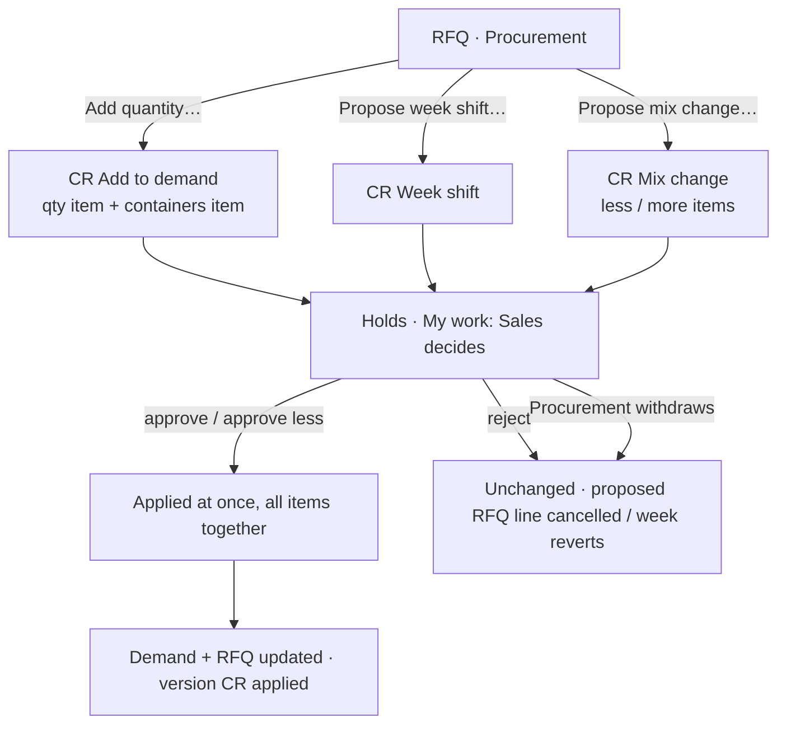

# 19 · Procurement change requests: add quantity, week shift, mix change (Stage 4b)

**Status:** Accepted 2026-09-24 (Stage 4b of the Demand-to-PO plan v5, rules 7–9 of §4).

## Purpose
While sourcing, Procurement sometimes finds that the market does not fit the demand exactly: a supplier offers **more** than asked, can deliver **in another week**, or offers a **different mix** (other sizes or materials). Procurement proposes the change from the RFQ; **Sales decides** each item, as in Stage 2 (spec 14) but the other way round. Nothing changes the demand until Sales approves; while the request waits, what it touches is on hold (award, Stage 5, waits for the decision).

## Users
- **Procurement** raises (`cr.raise.procurement`, already held since Stage 2) from an RFQ they manage.
- **Sales** decides (`cr.decide.procurement`, already held) from My work → *Decide change request*.

## The three requests
| Request | Raised from | Items (each decided on its own) | On approval | On rejection |
|---|---|---|---|---|
| **Add quantity** | RFQ page → **Add quantity…** | **Quantity**: material (category · sub-category · size · class · origin, optional SKU), ETD week, quantity. **Extra containers** (optional): for that week. | Quantity: added to the demand line of that week (new line if the material is new), as *Procurement* quantity, straight into this RFQ (Quoted if already quoted). Sales may approve **less** (0 … proposed). Containers: the demand week +N (Sales may approve fewer), independently of the quantity. | Quantity rejected → the proposed RFQ line is *Cancelled* (off the supplier view). Containers rejected → week unchanged. |
| **Week shift** | RFQ line → **Propose week shift…** | One item: this RFQ line's quantity (all of it not yet awarded) from week A to week B, with containers for week B in the RFQ. | The quantity's approved ETD week becomes B (it stays on its demand line, shown "approved for B"). | The RFQ line goes back to week A. |
| **Mix change** | RFQ page → **Propose mix change…** | **Less** of some RFQ lines (none awarded) and/or **more / new** materials in the same weeks. | Less: cancelled on the demand (origin *Change*, not counted against Procurement). More: added to the demand as *Change* quantity, **Open** (Procurement adds it to an RFQ). Sales may approve less of an addition. | Unchanged. |

A request always has a **reason** (Procurement reasons: *Market opportunity*, *Supply only in another week*, …) and a **comment**.

## Main path (Add quantity)
1. RFQ page (Sent or Quoting) → **Add quantity…**: pick the material (same pickers as the demand), week (one of the RFQ's weeks or a later one), quantity, optional extra containers, reason, comment → **Send to Sales**.
2. The RFQ gets a line marked *Pending Sales · CR-000031* whose quantity already shows in the **supplier view** (suppliers can quote it); award waits for Sales (Stage 5).
3. Sales (My work → *Decide change request*) sees: "Add 1,000 CT Apples Royal Gala S-113 Cat1 CL to 2026-W42 (RFQ-000007)" and "Add 1 container to 2026-W42"; decides each: **Approve** / **Approve less** / **Reject**; decision comment.
4. Applied at once, all items together: demand line +600 CT (*Procurement*), In RFQ / Quoted on RFQ-000007; week containers unchanged if that item was rejected.

## Main path (Week shift)
1. RFQ page → an RFQ line → **Propose week shift…**: new week (later or earlier, current week or later), containers for the new week in this RFQ (default: this line's share), reason, comment → **Send to Sales**.
2. The RFQ line shows the new week with *Pending Sales · CR-…* and is on hold (quotes can still be recorded; award waits).
3. Sales approves → the quantity is approved for the new week; the demand shows it on its line as "approved for 2026-W43". Rejects → back to the old week.

## Main path (Mix change)
1. RFQ page → **Propose mix change…**: a table of the RFQ's lines with **Less by** (up to what is still in the RFQ; lines with awarded quantity are not offered) and **Add material** rows (material, week among the RFQ's weeks, quantity), reason, comment → **Check** (what changes) → **Send to Sales**.
2. Sales decides each item. Reductions: released from the RFQ and cancelled on the demand. Additions: Open on the demand — Procurement adds them to an RFQ (4a).

## Holds while Sales decides (as Stage 2)
Add quantity holds the **week** (no other request may change that week's containers); week shift and mix change hold the **lines** they touch (and the week of an addition). Holds show on the demand (⏸) and the RFQ. A Sales change request cannot touch held weeks/lines, and vice versa (the pre-check says so). Procurement can **Withdraw** its request: nothing changes, holds released, a proposed RFQ line is cancelled, a proposed week reverts.

## Process flow

## Loose-end check
| Case | Outcome |
|---|---|
| Unit of the added material differs from the demand's unit for that key | Blocked at raising (*unit mismatch*). |
| Added material has no usable SKU in SAP for its specification | Blocked (as in demand entry). |
| Week shift or mix reduction on quantity already awarded (Stage 5) | Not offered; the unawarded part of a partly awarded line moves to a new RFQ line for the new week. |
| Supplier quotes a pending added line, then Sales approves less | The quote stays; award (Stage 5) is limited to what was approved. |
| Sales approves the quantity but rejects the extra containers | Demand quantity rises, week containers unchanged (independent items, plan rule 7). |
| RFQ cancelled while a request is pending | Allowed; the request stays for Sales (approved additions then land **Open**, not in the cancelled RFQ). |
| The raiser tries to decide | Not possible (Stage 2 rule; decide needs the other department). |
| Two requests on the same week / line | The second is Blocked by the pre-check with the first one's number. |

## Screens
- **RFQ page:** buttons **Add quantity…** and **Propose mix change…**; per line **Propose week shift…**; lines show *Pending Sales · CR-…* chips; proposed lines show in the supplier view marked *proposed*.
- **Dialogs / pages** for the three requests (reason + comment + pre-check), reusing the demand material pickers.
- **Change request page (spec 14):** new item kinds with their wording and decisions (*Approve less* for quantities and containers); **Change requests** list gets the three types.
- **Demand page:** lines show "approved for W43" and *Procurement* / *Change* quantity in the history; Change requests tab lists them.

## Data (migration 0016)
Change request types `ADD_TO_DEMAND`, `WEEK_SHIFT`, `MIX_CHANGE`; item kinds `ADD_QTY`, `ADD_CONTAINERS`, `WEEK_SHIFT`, `MIX_REDUCE`, `MIX_ADD`. RFQ line: `AddCrId`, `WeekShiftCrId`, `ProposedQty`, `PreviousEtdWeek` (extra containers live on the request item); change request: `RfqId` (the RFQ it came from). Invariants: **8** (no award on a Procurement-added line before its request is applied — checked from Stage 5; the link is enforced now), **9** (week shift consistency: quantity of an RFQ line with an applied shift has the new approved week; a pending shift keeps the old approved week).

## Out of scope
- Award, and "award waits for the decision" in practice — Stage 5 (the holds are in place now).
- Procurement adding quantity without an RFQ (always via an RFQ, where the supplier's offer is).
