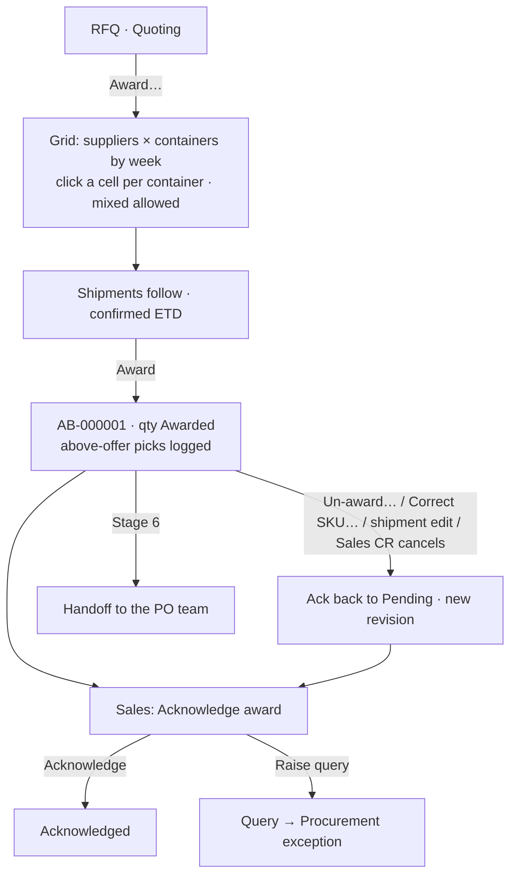

# 20 · Award: quote comparison, award batches, shipments, un-award, Sales acknowledgement (Stage 5)

**Status:** Revision 1 (award by containers) approved 2026-09-24, built, ACCEPTED 2026-09-25. Mockup: `docs/mockups/stage-5-award-containers.html`. (The first build, award by material quantity, was not accepted: *"I'm awarding containers and weeks, not materials."*)

## Purpose
Procurement decides **which supplier ships which containers**. Pricing is already done (quotes, spec 18), so an award is a choice of **containers per week**: all of a week to one supplier, or a **mixed award** — some containers from one supplier, the rest from another. The materials, quantities and prices of each awarded container follow from the container's **make-up** (the demand's container group: capacity and shares, spec 12) and the supplier's quote. Several awards (**award batches**) per RFQ are possible, e.g. the remaining containers later. For each supplier × week won — a **shipment** — Procurement adds the **confirmed ETD date** when known. An award can be reversed (**un-award**, by containers) until it is handed off (Stage 6). Sales **acknowledges** each award batch — a heads-up, never a blocker.

## Users
- **Procurement** (`award.manage`): awards, shipments, un-award, SKU correction.
- **Sales** (`ack.respond`): acknowledges or raises a query; sees awards on the demand.

## Main path — award (revision 1: by containers, a supplier × container grid)
1. RFQ page (Quoting) → **Award…** → a **grid** built for up to ~50 containers (and more) on one screen:
   - **Columns = suppliers** who quoted, each with its own **colour**, plus *Not awarded*. The **header row stays fixed** while scrolling (the grid scrolls inside its box) and shows each supplier's total containers; the first column also stays fixed when there are many suppliers. A **Total** row stays fixed at the bottom (containers and value per supplier, containers still Quoted).
   - **Week row** (grey band): *2026-W40 · Mon 28 Sep · 15 containers*; per supplier *n of m offered* (amber *+k* when above the offer) and *whole week*; *clear*.
   - **One row per container group** in the week (e.g. *Gala mix · 12 × 1,540 CT*, *Fuji · 3 × 1,540 CT*), with the mix once (*Royal Gala S-100 Cat1 616 · S-113 Cat1 924 CT per container*) and a **strip of squares, one per container**, coloured by the supplier that wins it (grey = not awarded, amber outline = above that supplier's offer).
   - **Assigning a container is one click:** first choose the supplier the squares go to — *Squares go to: [Frutícola Sur] [Andes Export] [Valle Verde] [Not awarded]* above the grid, or click the supplier's column header; the choice stays until changed. Then **one click on a square** gives that container to that supplier (a second click on the same square takes it back); **dragging** across squares assigns several at once. A supplier who did not price the mix cannot receive its squares.
   - In each supplier cell: that supplier's **quoted price per unit** per material, exactly as in the offer (lowest in green, *— not priced* when missing), and a **container count** with − / + (typing a number works too) — the counts and the squares are the same data, either can be used. The cell is tinted in the supplier's colour when it wins containers.
   - **+ Add container** under a group adds one more container of the same mix at the quoted prices (shown with a *+* in the strip; *undo* until the award is saved).
   - Containers carry **no invented labels**: they are identical within a group; the real container numbers come later from the supplier / shipping line.
2. **Tools:** *As offered (cheapest first)* — fills each week with each supplier's offered containers, cheapest first · *All to the cheapest* · *whole week* per supplier · *Clear*.
3. **Shipments** (read only except the date): supplier × week, containers = what was picked, **confirmed ETD** (optional now, needed before handoff), and — only when above the offer — an optional note. Folded: the **materials awarded** (containers × group quantity, price per unit).
4. **Award** (confirm) → batch **AB-000001**: the quantity leaves *Quoted* for *Awarded*; SKU as before; Sales gets **Acknowledge award** on My work. Problems that do block (see rules) are listed at once.
5. Containers **not awarded stay Quoted** — award them in a later batch, or **Release…** them to Open from the RFQ page (reason).

## Award rules
| Rule | Detail |
|---|---|
| Containers | The rows are the RFQ's containers plus any **added** ones; a make-up never gets more containers than it has rows. |
| Added containers | Saved with the award: the demand gains the make-up's quantity per added container as **Procurement-added quantity** (origin Procurement, as spec 19, so KPIs keep it apart), the RFQ week's container count grows, the award's Changes log records *Added n container(s): <make-up>, <week>*, and Sales sees it in the acknowledgement. Unlike *Add quantity…* (spec 19) it does not wait for Sales' approval — Sales is informed, and can raise a query or a change request. |
| Above the offer | Picking more containers for a supplier than they offered for that week is **allowed, never refused**: the cell turns amber (*above the offer*), and the award's **Changes log** records *Above the offer: <supplier>, <week>, n containers (offered m)* with an optional note. |
| Full mix priced | A cell is disabled (*— not priced*) when the supplier's current quote does not price every material of the make-up. |
| Quantity | Each container gets the make-up's quantities; the last container of a make-up takes the rounding remainder, so all containers together = the make-up's quantity exactly. |
| One currency | All of one supplier's containers in one batch share one currency. |
| Supplier | Usable (not blocked, extended to the company) and able to supply the make-up's origin(s). |
| Holds | A container whose material is held by a change request, waits for a week shift, or is a Procurement proposal still waiting for Sales is shown locked with the reason. |

**Quantity outside any make-up** (Procurement additions, spec 19, and mix changes): shown as its own card *Added quantity* per week and awarded **by quantity** to one supplier, with the same rules as before — the only place a quantity is typed.

## After the award
- **Award batch page** (`/awards/:id`): **containers** per supplier × week × make-up (with the over-offered reason if any), the materials they give (quantity, price, currency, SKU + status), shipments (containers from the award; confirmed ETD editable until handoff), acknowledgement status with its history, comments, attachments.
- **Un-award…** (per supplier × week × make-up, **n containers**, reason): *keep the quotes* (back to Quoted, can be awarded again, e.g. to the other supplier) or *release* (back to Open). The materials shrink with the containers; a shipment with no containers left becomes inactive (kept in history).
- **Correct SKU…** (per item, reason): another SKU of the **same specification** (category, sub-category, size, class, origin, unit). If it replaces the demand's SKU, Sales is told.
- **Week shift on a partly awarded RFQ line** (spec 19): now allowed — the unawarded part moves to a new RFQ line for the proposed week.
- **A Sales change request cancelling awarded quantity** (Stage 2): the award item shrinks, Procurement gets a task *Tell the supplier* on My work.

## Sales acknowledgement
- One per award batch, *Pending* until Sales responds; a My work task **Acknowledge award** for the demand's Sales.
- The Sales view shows per week and supplier: quantities, prices, containers, confirmed ETDs, what was released, and any week shifts / merged-in / Procurement-added quantity / SKU corrections.
- **Acknowledge** (optional comment) or **Raise query** (comment required → an exception *Award query* on Procurement's My work; answered in the batch's comments).
- **Any change** to the batch afterwards (un-award, SKU correction, shipment edit, cancellation) puts it back to *Pending* with a new revision and a new task; the history keeps what was acknowledged at each revision.
- Never blocks anything; Stage 6 (handoff) records when a batch was handed off without an acknowledgement.

## Process flow

## Loose-end check
| Case | Outcome |
|---|---|
| Supplier re-quotes after an award | Later awards use the new quote; earlier items keep their quote and price. |
| More containers than the supplier offered | Allowed; logged in the award's Changes log (optional note). |
| A supplier did not price one material of a make-up | Cannot win that make-up's containers (shown why); re-quote first. |
| Not all containers awarded | The rest stay Quoted; award later or release. |
| Two make-ups in one week | Each has its own container rows under the week. |
| A supplier offers extra containers at award time | **+ Add container** under the make-up; awarded at the quoted prices; the demand grows (Procurement-added); logged; Sales informed. |
| Two buyers award from the same RFQ at once | Version check on the RFQ: the second gets "changed meanwhile — reload". |
| Confirmed ETD outside the ETD week | Allowed with a warning chip (the ETD week stays what was agreed). |
| Un-award on quantity already handed off | Not offered (Stage 6 returns it first). |
| Sales cancels awarded quantity by change request | Item reduced, shipment deactivated if empty, *Tell the supplier* task, acknowledgement reset. |
| Merge / unmerge (Stage 3) | Unmerge stays blocked while any merged quantity is awarded. |
| RFQ cancelled | Blocked while anything is awarded (4a rule: un-award first). |

## Screens
- **Quote comparison & award** (`/rfqs/:id/award`), **Award batch** (`/awards/:id`, Procurement and Sales views of the same page), **Awards tab** on the RFQ and on the demand, **Purchasing → Awards** list (batch, RFQ, demand, company, suppliers, quantity, acknowledgement status).
- **My work:** *Acknowledge award* (Sales task), *Award query* (Procurement exception), *Tell the supplier* (Procurement task, after a cancellation of awarded quantity).

## Data (migration 0018 + 0019 for revision 1)
**0019:** `AwardContainer` (batch, supplier, week, make-up = container group, containers, active); `AwardItemChange` gains types `ABOVE_OFFER` (containers, offered, optional note) and `CONTAINERS_ADDED` (make-up, week, n); added containers create Procurement-origin slices on the make-up's demand lines — the award decision; `AwardItem` rows (per RFQ line × supplier) are worked out from it and keep the ledger as before. Shipment containers = Σ active award containers (no longer typed). Invariants added: award containers per make-up ≤ its RFQ containers; award item quantity = Σ containers × make-up quantity.
`AwardBatch`, `AwardItem` (quote, price and currency copied from it, override reason, SKU status), `AwardItemChange` (every un-award, cancellation, SKU correction), `AwardShipment` (containers, confirmed ETD, active), `AwardItemSku` (SKU allocations), `SalesAck` + `SalesAckHistory` (revision, snapshot of what was acknowledged). Permissions `awards.open`, `award.manage` (Procurement), `ack.respond` (Sales).
**Invariants:** 4 (award part: Awarded quantity has an award item of the same RFQ line), 5 (award item quantity = its awarded quantity), 7 (no award while the line was on hold), 10 (every active supplier × week award has an active shipment with ≥ 1 container), 19 (revision 1: every award above a supplier's offered containers has an ABOVE_OFFER log entry), 22 (one currency per batch × supplier), 24 (a SKU allocation's material has the line's origin).

## Out of scope
- Shipping terms and the handoff to the PO team (Stage 6); PO creation and SAP (Stage 7).
- Emailing award letters to suppliers (plan Stage 9).
