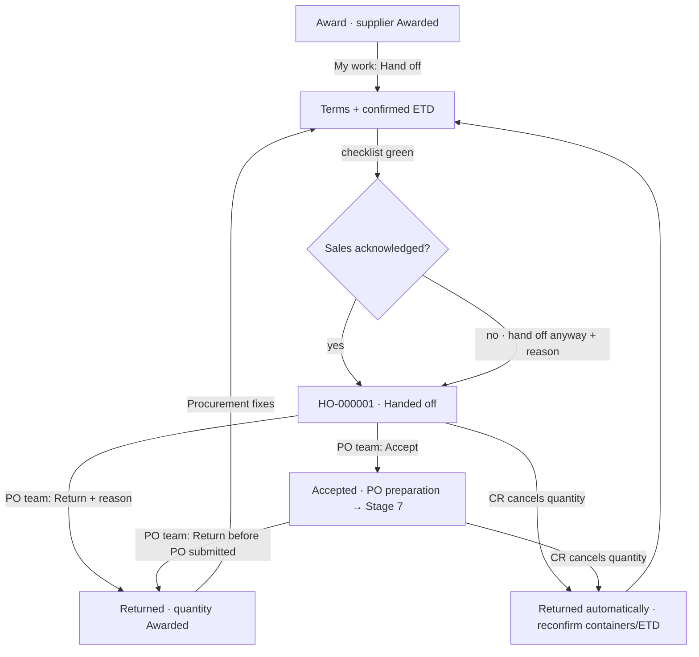

# 22 · Shipping terms and handoff to the PO team (Stage 6)

**Status:** Accepted 2026-09-25 (Stage 6 of the Demand-to-PO plan v5), with one addition made before acceptance: supplier data on the handoff page. Mockup: `docs/mockups/stage-6.html`.

## Purpose
Procurement completes the **shipping terms** for each supplier of an award and **hands that supplier's part off** to the PO creation team. **One handoff = one supplier of one award = one purchase order** (Stage 7). The PO team **accepts** it (the quantity moves to PO preparation) or **returns** it to Procurement with a reason. What was sent is kept exactly as sent. Sales' acknowledgement is checked only here, and only as a warning.

## Users
- **Procurement** (`handoff.send`): terms, confirmed ETD, hand off; fixes returned handoffs.
- **PO team** — a **new role** (`handoffs.open`, `handoff.accept`, `handoff.return`) with a **Demo PO team** account for View as.
- **Sales**: sees the handoff status on the demand and the award (read only).

## Decisions (user, 2026-09-25)
- **Term choices:** from SAP where SAP has them, otherwise lists in Configuration. SAP check on 25 Sep: **payment terms** are filled for 3,379 of 3,538 suppliers (codes only: ME00, N015, ME15, S005, N030 …); **Incoterm + location** only for 63 local suppliers (FCA Dammam/Jeddah…); **ports** are not in SAP. So: payment term = the supplier's SAP code (default), descriptions kept in Configuration; Incoterms and ports are Configuration lists (SAP's Incoterm/location, when present, is the default).
- **Pre-fill:** from the supplier's last handoff; else the SAP defaults. Currency is always the award's currency (fixed).
- **PO team:** a new role, separate from Procurement.

## Main path — Procurement
1. **My work → Hand off** (new task, one per award × supplier that is awarded and not handed off; due from the settings). This is also how an acknowledged award is found again.
2. Award page → **Handoff** tab: one card per supplier (containers, quantity, value, handoff status):
   - **Shipping terms:** Incoterm, port of loading (ports of the supplier's origin country first), port of discharge, payment terms (code · description), currency (fixed). Each field says where its value came from (last handoff / SAP / list). **Save terms** any time.
   - **Shipments:** containers (from the award) and **confirmed ETD** (editable here, as on the award).
   - **Ready to hand off?** live checklist: terms complete · terms currency = award currency · confirmed ETD for every shipment · no material on hold · all of the supplier's quantity Awarded · supplier usable in SAP · (warning) Sales acknowledged · (warning) master data older than the configured age.
3. **Hand off to PO team** (every check green) → **HO-000001**; the supplier's quantity moves Awarded → Handed off; the PO team gets **Accept handoff** on My work.
4. If Sales has **not acknowledged**: a dialog "Sales has not acknowledged AB-… Hand off anyway?" with a reason (URGENT / OTHER) and optional comment → the handoff is marked **without Sales acknowledgement**; when Sales acknowledges later it shows **Acknowledged by Sales after handoff**.

## Main path — PO team
1. **My work → Accept handoff**, or **Purchasing → Handoffs** (list: handoff, supplier, award · demand, containers · weeks, terms, status, last step).
2. Handoff page — **exactly as sent** (a snapshot): **supplier** (code, name, country · origins, purchasing org and whether blocked, SAP payment terms and Incoterm, city, e-mail), terms, shipments (containers, confirmed ETD), materials (quantity, price, value, SKU), acknowledgement at the time, who sent it and when.
3. **Accept** → the quantity moves to **PO preparation** (Stage 7 prepares the PO), or **Return to Procurement…** with a reason (SKU_ISSUE, TERMS, SHIPMENT, DATA, OTHER) and a **required** comment → the quantity goes back to Awarded, terms/shipments/SKU are editable again, Procurement gets **Handoff returned** (exception) on My work. Return is allowed from *Handed off* and from *Accepted* (until the PO is submitted — Stage 7).

## Rules
| Rule | Detail |
|---|---|
| One open handoff | At most one open (Handed off / Accepted) handoff per award × supplier. Each send gets a new number; a returned one keeps its snapshot. |
| Terms | All five fields required; currency must equal the award's currency for that supplier. |
| Readiness | As the checklist above; the handoff is refused with every failing check listed. |
| Acknowledgement | Only a warning, only here. Hand off anyway → marked, reason logged. |
| Snapshot | Supplier data, terms, shipments, materials (qty, price, currency, SKU) and the acknowledgement revision are stored as sent; later edits never change an earlier handoff. |
| Automatic return | A change request that cancels quantity already handed off or accepted returns that handoff automatically (reason CR_CHANGE); Procurement gets an exception to reconfirm containers and ETD and hand off again. The PO team never changes containers. |
| First confirmed ETD | Entering a shipment's confirmed ETD for the first time does not send Sales' acknowledgement back to Pending (it is expected work before the handoff); changing containers or an existing ETD still does. |
| After handoff | The award can no longer be un-awarded, SKU-corrected or its shipment edited for that supplier until the handoff is returned (already true in Stage 5). |

## Statuses (spec 21 style)
| Handoff | Label | Who has it · next |
|---|---|---|
| HANDED_OFF | **Waiting for the PO team to accept** | PO team: accept or return |
| ACCEPTED | **Accepted — PO being prepared** | PO team (Stage 7) |
| RETURNED | **Returned to Procurement** (+ reason) | Procurement: fix and hand off again |

The award's Handoff tab shows per supplier *Not handed off yet* / the handoff's status. The demand and RFQ process steps reach **Handed off**. My work: **Hand off** (Procurement task), **Handoff returned** / **Handoff returned automatically** (Procurement exceptions), **Accept handoff** (PO team task).

## Configuration → Shipping terms (new tab)
- **Incoterms:** the 11 Incoterms 2020, switch on/off.
- **Ports:** name, country, used for loading / discharge / both, on/off.
- **Payment terms:** every SAP code seen in the supplier sync (added automatically), with a description to fill in once and the number of suppliers using it.
- **Supplier sync (spec 08 update):** also reads each supplier's payment terms, Incoterm and Incoterm location per purchasing organization (SAP `A_SupplierPurchasingOrg`), shown on the supplier page.

## Process flow

## Loose-end check
| Case | Outcome |
|---|---|
| Two suppliers in one award | Two cards, two handoffs; one returned does not touch the other. |
| Terms edited after a return | The new handoff has the new terms; the returned one still shows what was sent. |
| Supplier blocked in SAP after the award | Readiness fails with the SAP reason; nothing is sent. |
| A payment term code without description | Shown as the code; Configuration lists it to describe. |
| A port missing from the list | Admin adds it in Configuration (buyers cannot type free text). |
| Hand off without acknowledgement, then Sales raises a query | The query goes to Procurement as today; the handoff is not blocked. |
| PO submitted (Stage 7) | Return no longer possible (Stage 7 rule). |

## Data (migration 0020)
`ShippingTerms` (award batch × supplier: incoterm, ports, payment terms, currency, complete), `Handoff` (HO-number, award batch, supplier, status, quantity, snapshot JSON, sent by/at, without-ack flag + reason, ack revision, accepted by/at, returned by/at/from, return reason + comment + CR), `QtySlice.HandoffId` FK; reference lists `Incoterm`, `Port`, `PaymentTerm` (code, description); `md.SupplierPurchasingOrg` + PaymentTerms, Incoterm, IncotermLocation; role **PO team**, permissions `handoffs.open`, `handoff.send` (Procurement), `handoff.accept`, `handoff.return`; demo user **Demo PO team**; My work item types HANDOFF_READY, HANDOFF_TO_ACCEPT, HANDOFF_RETURNED, HANDOFF_AUTO_RETURNED.
**Invariants:** 4 (handoff part: handed-off / PO-preparation quantity has an open handoff of its own supplier and batch), 10 (ETD part: every open handoff's shipments have a confirmed ETD), one open handoff per batch × supplier, snapshot never changes.

## Out of scope
PO preparation, SKU picking by the PO team and the SAP submission (Stage 7); e-mail to the PO team (Stage 9 notifications).
