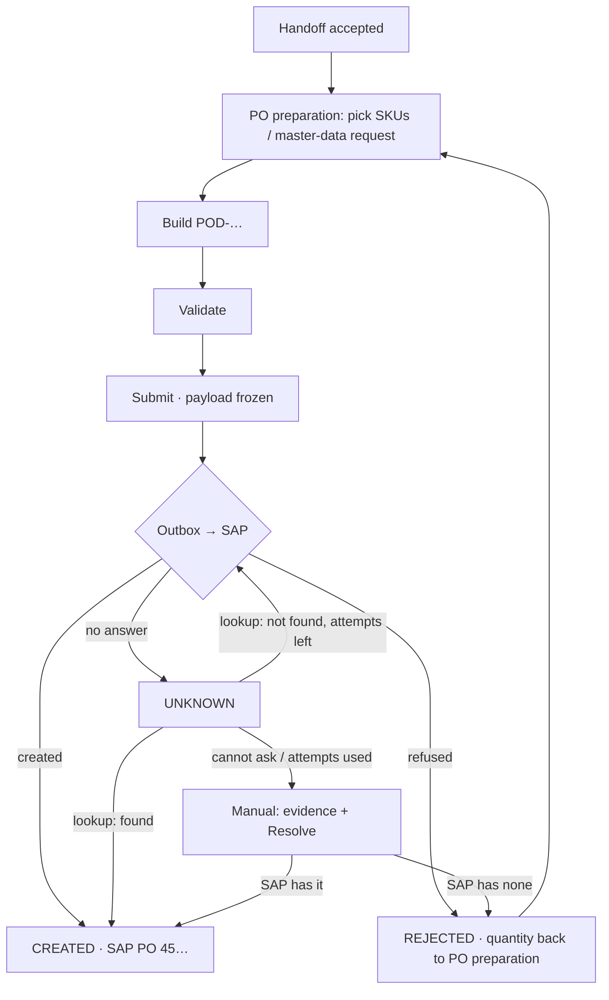

# 23 · PO preparation, PO draft and the SAP outbox (Stage 7)

**Status:** Built 2026-09-25 under the standing instruction "finish all remaining stages" (no separate mockup approval): waiting for acceptance. Stage 7 of the Demand-to-PO plan v5. Where purchase orders go is set in **Configuration → SAP purchase orders**: the built-in simulator, or the company's PO API.

## Purpose
The PO team turns an **accepted handoff** into **one SAP purchase order**: it picks SKUs where none was provided, builds and validates a PO draft, and submits it. The SAP call runs through an **outbox**. At most one SAP PO is ever created per draft, and quantity is never unlocked while the SAP outcome is unknown.

## Users
- **PO team** (`po.open`, `po.manage`): SKUs, master-data requests, build / validate / submit, resolve unknown outcomes.
- **Procurement, Sales** (`po.open`): read the drafts and their SAP result.
- **Administrators** (`configuration.sap.edit`): the SAP stub's fault injection (test servers only).

## Main path
1. **My work → Prepare the PO for HO-…** (task opened when the handoff is accepted) → the handoff page's **PO preparation** card lists one row per award item (week, material, quantity, confirmed ETD, SKU).
2. **Pick SKU…** where the SKU is *to pick*. The list offers only materials matching the specification, origin and unit. You can split one item across several SKUs, as long as the quantities add up exactly. A SKU provided by Sales or Procurement is fixed: if it is wrong, return the handoff (SKU issue).
3. **Not in SAP…** when no material exists: a **master-data request** is noted and the item waits (*waiting for SAP master data*). Once the material is created in SAP (outside the portal), close the request under **PO drafts & SAP → Master data requests**, then pick the SKU.
4. **Build PO draft**. One draft per handoff covers all weeks and becomes **POD-000001**. The header comes from the handoff snapshot: supplier, company, plant, purchasing org and group, Incoterm, ports, payment terms, currency, containers.
5. **Validate**, which lists every problem. It checks:
   - SKUs are set and valid
   - the supplier is usable in SAP
   - master data is fresh (see the settings)
   - currency and prices are complete
   - the plant and purchasing org exist
6. **Submit to SAP** (after a confirmation). The checks run again. The payload is **frozen**, with a SHA-256 hash and one idempotency key. The quantity moves to *PO submitted*.
7. The **outbox** runs every 30 seconds, or on **Process now**:
   - **Created:** the SAP PO number is stored and the quantity moves to *PO created*.
   - **Refused:** the quantity goes back to *PO preparation* and a *SAP rejected* exception is raised. The team fixes the problem and builds a new draft, which gets a new number and a new key.
   - **No answer:** the draft becomes *SAP outcome unknown*. The quantity stays *PO submitted*.
8. **An unknown outcome is never resent blindly.** SAP is asked by the portal reference (POD-…):
   - **Found:** the PO is created.
   - **Confirmed absent:** the same payload is resent with the same key, up to 3 attempts.
   - **SAP can't be asked** after 5 checks: the draft goes to **manual** and a *SAP outcome unknown* exception is raised. The PO team checks SAP, attaches the **evidence** (uploaded after the submission), and chooses **Resolve**. They either record "SAP has the PO" with its number, or "SAP has no PO", which unlocks the quantity. SAP is asked once more when it is reachable, so a wrong answer is refused.

## Configuration → SAP purchase orders (added 2026-09-25)
Administrators (`configuration.sap.edit`) choose where submitted purchase orders go:

- **Simulator (test only).** This is the default. A production server refuses to submit to it unless `ALLOW_SAP_STUB=true`.
- **PO API (SAP).** The company's API, called by a generic HTTP adapter (`modules/po/sapHttpAdapter.ts`):

  | Setting | Meaning |
  |---|---|
  | Base URL | The address of the API |
  | Create path (POST) | Receives the frozen draft, plus the reference field |
  | Lookup path (GET) | Must contain `{reference}` |
  | SAP field for the portal reference | Required |
  | PO number in the reply | Dot path to the PO number, e.g. `d.PurchaseOrder` |
  | SAP client | |
  | Sign-in | Basic user and password (stored encrypted), or none |
  | CSRF token fetch | For SAP Gateway |
  | Self-signed certificate | Allow or not |
  | Timeout | Under the 5-minute lease |

  **Test lookup** asks for a reference that can't exist, and never creates anything. An incomplete setting sends nothing and lists what is missing.

  How replies are read:
  - 2xx with a PO number → created
  - 4xx → refused, with SAP's message
  - anything else (5xx, timeout, no reply, 2xx without a number) → **unknown**, which is then looked up and never resent blindly

When the API's contract arrives, only the field mapping (`toSapBody`) is expected to change.

## Rules
| Rule | Detail |
|---|---|
| One PO per handoff | A unique index allows one live draft per handoff (DRAFT, VALIDATED, SUBMITTED, UNKNOWN, CREATED). A rejected or void draft doesn't count. |
| Frozen payload | What was sent is stored with its hash. If the stored payload changes, it is not sent; it goes to manual. |
| Lease | A claim lasts 5 minutes. An expired claim (the worker crashed) becomes *unknown*: SAP is asked before any resend. |
| Late replies | A SAP answer for a draft that is already settled changes nothing. It raises a *late SAP reply* exception so a person can check for a duplicate. |
| Return | A handoff can be returned until its PO is submitted. Returning it voids any unsubmitted draft. Submit and return lock the handoff in the same order, so they never overlap. |
| One run at a time | The timer and **Process now** share one run per server. Reconcile claims its rows, so two servers never ask about the same draft at once. |
| Stub safety | Fault injection needs `configuration.sap.edit`. A production server (`NODE_ENV=production`) refuses to **submit** to the simulator unless `ALLOW_SAP_STUB=true`, so it can start, and the administrator can then enter the PO API. |

## Statuses (spec 21 style, `PO_STATUS`)
| Draft | Label | Who has it · next |
|---|---|---|
| DRAFT | Draft — not validated | PO team: validate |
| VALIDATED | Validated — ready to submit | PO team: submit |
| SUBMITTED | Sent to SAP — waiting for the answer | the outbox |
| UNKNOWN | SAP outcome unknown | the outbox asks SAP, then the PO team |
| CREATED | Created in SAP | done |
| REJECTED | Not created in SAP | PO team: fix and build again |
| VOID | Void (handoff returned) | — |

## Screens
- **Handoff page → PO preparation** card (above). A rejected draft has a **Go to PO preparation** button.
- **PO drafts & SAP**, with three tabs:
  - **PO drafts:** search, status filter, status legend.
  - **Master data requests.**
  - **SAP connection (stub):** fault injection, **Process now**. Administrators only.
- **PO draft page:**
  - header, items and checks
  - **SAP submission** card: status in plain words, send and ask counts, the attempts table, and the frozen payload key and hash on hover
  - comments, evidence and attachments
  - **Resolve…**

## Process flow

## Loose-end check
| Case | Outcome |
|---|---|
| Worker crashes mid-send | The lease expires, the draft goes to UNKNOWN, SAP is asked, never resent blindly (DB test). |
| Reply lost after SAP created the PO | UNKNOWN, then the lookup finds it and the draft is CREATED. One PO (DB test, e2e). |
| Request lost before SAP created it | The lookup finds nothing, so the same key is resent and one PO is created (DB test). |
| SAP unreachable for lookups | 5 checks, then manual, then evidence and resolve (DB test). |
| Returned handoff with an unsubmitted draft | The draft is voided (Stage 6 test). |
| Another company's user | Not found on every read and write (negative-authorization test). |

## Data (migration 0021)
- `MasterDataRequest`, `PoDraft` (+ unique live index), `PoDraftItem`
- `SapSubmission` (key, reference, payload, hash, status, attempts, checks, lease), `SapSubmissionAttempt`
- `StubSapPo`, `StubSapFault`
- Permissions `po.open` and `po.manage`
- My work types PO_TO_PREPARE, MASTER_DATA_MISSING, SAP_REJECTED, SAP_UNKNOWN

**Invariants:** 11, 12, 13 (no split after submit), 17, 20, 21 (`tests/invariants/27_po.sql`).

## Out of scope
- The real SAP (ZCON) adapter and the SAP field that stores the portal reference (Stage 9; **required before production**)
- Changes after the PO is created
- E-mailing the PO to the supplier
