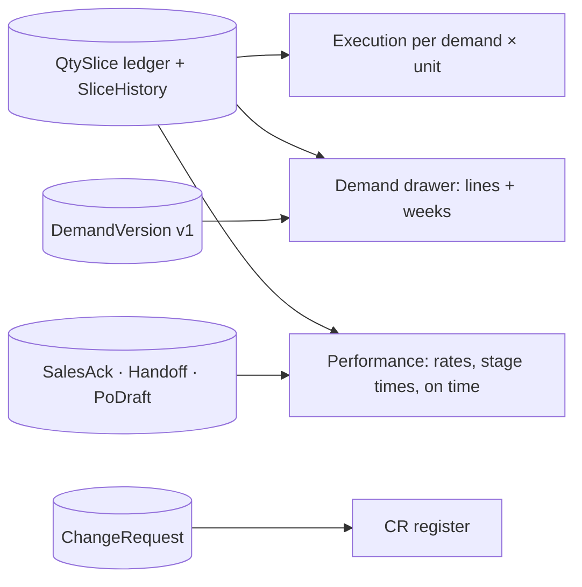

# 24 · Reports and KPIs (Stage 8)

**Status:** Built 2026-09-25 under the standing instruction "finish all remaining stages": waiting for acceptance. Stage 8 of the Demand-to-PO plan v5.

## Purpose
This screen answers three questions: what Sales asked for, what was ordered in SAP, and how long it took. The reports read the quantity ledger directly, so there is no second copy that can drift. **Quantities are never added across units.** A ratio with nothing to divide by shows **N/A**, not 0%.

## Users
Sales, Procurement and the PO team (`reports.open`, granted by migration 0022). Each user sees only their own companies.

## Screen: Purchasing → Reports
Filters apply to every tab: a search on demand or change request number, and **From/To** dates. The dates filter on:
- the demand's acceptance date (execution, performance headline)
- when the change request was raised (register, CR response)
- when the award was created (acknowledgement)
- when the handoff was sent (handoffs)
- when the draft was submitted (SAP)

### Demand execution
One row per accepted demand and unit:
- **Committed:** what Sales asked for and did not cancel. Merged-away quantity counts on the demand it merged into.
- **Executed:** SAP PO created.
- **Outstanding:** still in progress.
- **Not sourced:** cancelled by Procurement.
- **Cancelled by Sales.**
- **Procurement added · ordered:** shown apart and not part of the rate.
- **Execution %.**

**Export CSV.** Click a row to open the **demand drawer**:
- **Containers per week:** baseline (version 1), now, awarded, ordered (SAP PO).
- **Lines:**
  - baseline (v1) and requested now
  - where the quantity is: open, in RFQ, awarded, handed off, PO submitted, PO created
  - cancelled by Sales, not sourced, cancelled by change
  - merged in and out, Procurement added
  - the SAP PO numbers
- **Export CSV.**

### Change request register
Every change request shows:
- type
- who raised it (department) and when
- reason and comment
- status and apply status, in plain words
- who decided it and after how long
- requested · approved · applied quantities. They are summed only when all items share one unit; otherwise the column shows "several units".

**Export CSV.**

### Performance
Per unit:
- committed and executed
- **execution rate** and **not-sourced rate**
- **on time**: the PO was created at least *n* days before the confirmed ETD. *n* is the workflow setting `kpiOnTimeDaysBeforeEtd`, default 7.
- **accepted → PO created**
- stage times, weighted by quantity and counted only for quantity that reached PO created: accept → RFQ, RFQ → quote, quote → award, award → handoff, handoff accepted → PO created, and end to end.

The stage times follow split slices back to their origin. An ancestor slice's events count only until the child split off.

Also:
- **Change requests:** decided per department, with the average response time.
- **Sales acknowledgement:** batches, average hours to acknowledge (real acknowledgements only), resets, handed off without it.
- **Handoffs:** returned by the PO team (rate), returned automatically, SKU issues, sent without acknowledgement.
- **SAP:** submitted, created on the first reply (rate), after a lookup, resolved by hand, rejected, unknown now.

## Rules
| Rule | Detail |
|---|---|
| Units | Never added across units. Headline and stage times are per unit. |
| N/A | Any ratio whose denominator is zero. |
| Origin | Business origin (Sales, Change, Procurement), not how quantity arrived (a merge), decides the category. |
| Baseline | Version 1 as accepted (the `DemandVersion` snapshot). "Requested now" is shown next to it. |
| Scope | Company scope on every query. Another company's demand is not found (DB test). |

## Process flow

## Loose-end check
| Case | Outcome |
|---|---|
| A demand with no PO yet | Executed 0, execution 0%. N/A only when nothing is committed. |
| Two units in one demand | Two rows. Never one total. |
| Quantity added by Procurement | Shown apart and outside the rate. |
| Merged demand | The merged-in quantity counts on the target; the source shows *merged out*. |
| A slice split during RFQ | Its stage times use its parent's events until the split, then its own. |

## Data
- Migration 0022 grants `reports.open` to Sales, Procurement and the PO team.
- No report tables: queries run on the ledger (`apps/api/src/modules/reports/reports.ts`).

## Out of scope
- An Excel (.xlsx) export; CSV opens in Excel.
- Container comparison across demands.
- A Submit → Accept KPI.
- On-time in each company's own time zone.
- KPI owners and definitions page.

These are listed in the backlog.
