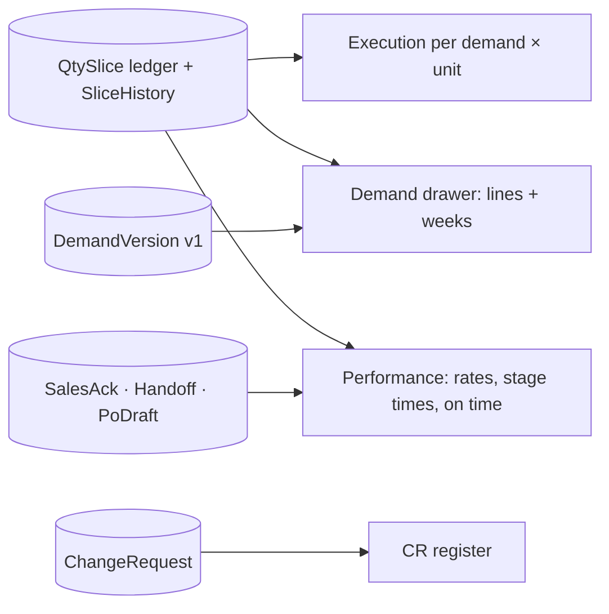

# 24 · Reports and KPIs (Stage 8)

**Status:** Built 2026-09-25 under the standing instruction "finish all remaining stages": waiting for acceptance. Stage 8 of the Demand-to-PO plan v5.

## Purpose
This screen answers three questions: what Sales asked for, what was ordered in SAP, and how long it took. The reports read the quantity ledger directly, so there is no second copy that can drift. **Quantities are never added across units.** A ratio with nothing to divide by shows **N/A**, not 0%.

## Users
Sales, Procurement and the PO team (`reports.open`, granted by migration 0022). Each user sees only their own companies.

## Screen: Purchasing → Reports
A **Dashboard** tab (spec 26) opens first; the three tabs below are unchanged. Filters apply to every tab: a **Company** multi-select (added with spec 26), a search, and **From/To** dates. The search's placeholder says what it matches on the open tab (execution and Performance: demand number; register: CR or demand number; spec 28 tabs: see there). On **Performance it narrows every section** — headline, stage times, CR response, acknowledgement, handoffs and SAP — to records of matching demands. The Dashboard and Trend have no search: the box is disabled there with a hint. The dates must be real calendar dates with From ≤ To; anything else is refused (400) before a query runs. The dates filter on:
- the demand's acceptance date (execution, performance headline)
- when the change request was raised (register, CR response)
- when the award was created (acknowledgement)
- when the handoff was sent (handoffs)
- when the draft was submitted (SAP)

### Demand execution
One row per accepted demand and unit:
- **Committed:** what Sales asked for and did not cancel. Merged-away quantity counts on the demand it merged into.
- **Executed:** SAP PO created.
- **Outstanding:** still in progress.
- **Not sourced:** cancelled by Procurement.
- **Cancelled by Sales.**
- **Procurement added · ordered:** shown apart and not part of the rate.
- **Execution %.**

**Export to Excel.** Click the demand number (a button, so the keyboard reaches it) or the row to open the **demand drawer**:
- **Containers per week:** baseline (version 1), now, awarded, ordered (SAP PO).
- **Lines:**
  - baseline (v1) and requested now
  - where the quantity is: open, in RFQ, awarded, handed off, PO submitted, PO created
  - cancelled by Sales, not sourced, cancelled by change
  - merged in and out, Procurement added
  - the SAP PO numbers
- **Export to Excel**, with two sheets: *Lines* and *Containers per week*.

### Change request register
Every change request shows:
- type
- who raised it (department) and when
- reason and comment
- status and apply status, in plain words
- who decided it and after how long
- requested · approved · applied quantities. They are summed only when all items share one unit; otherwise the column shows "several units".

**Export to Excel.**

### Performance
Per unit:
- committed and executed
- **execution rate** and **not-sourced rate**
- **on time**: the PO was created at least *n* days before the confirmed ETD. *n* is the workflow setting `kpiOnTimeDaysBeforeEtd`, default 7.
- **accepted → PO created**
- stage times, weighted by quantity and counted only for quantity that reached PO created: accept → RFQ, RFQ → quote, quote → award, award → handoff, handoff accepted → PO created, and end to end.

The stage times follow split slices back to their origin. An ancestor slice's events count only until the child split off.

Also:
- **Change requests:** decided per department, with the average response time.
- **Sales acknowledgement:** batches, average hours to acknowledge (real acknowledgements only), resets, handed off without it.
- **Handoffs:** returned by the PO team (rate), returned automatically, SKU issues, sent without acknowledgement.
- **SAP:** submitted, created on the first reply (rate), after a lookup, resolved by hand, rejected, unknown now.

Every rate and time carries its sample size **n** = the number of demands measured, e.g. "92% (n=12)"; N/A when there is nothing to measure. The quantity totals are summed exactly in milli-units (`headlineOf` in `modules/reports/pure.ts`, unit-tested) — they used to come out 1000× too small, and a fractional quantity failed.

**Export to Excel** (three sheets: headline, stage times, other KPIs).

All exports are real `.xlsx` files: the header row is frozen and filtered and the columns are sized. Only the columns a sheet declares numeric become numbers; identifiers (demand, CR, PO, supplier and material numbers) stay text exactly as shown. Every report export adds an **About this export** sheet: when it was made, the companies, period and search applied, and that quantities are per unit and must not be added across units.

### Tab counts and loading
The tab titles' counts come from one light procedure, **`reports.counts`** (`modules/reports/counts.ts`, `reports.open`, the same filter and company scope): COUNT queries with the same rows as each report. A tab's data loads only when the tab is opened. Paged tables go back to page 1 when a filter changes, and paging stays in the browser (each report is bounded by its period and companies). While the numbers of the previous filter are still on screen, a small **Updating…** tag shows.

## Rules
| Rule | Detail |
|---|---|
| Units | Never added across units. Headline and stage times are per unit. |
| N/A | Any ratio whose denominator is zero. |
| Origin | Business origin (Sales, Change, Procurement), not how quantity arrived (a merge), decides the category. |
| Baseline | Version 1 as accepted (the `DemandVersion` snapshot). "Requested now" is shown next to it. |
| Scope | Company scope on every query. Another company's demand is not found (DB test). |
| Returned handoffs | "Returned" everywhere (Performance, Trend, Suppliers, Dashboard D14) means returned **by the PO team** (`ReturnedBy` set); automatic returns are counted apart. |
| Sample size | Rates and times show *n* (demands measured); definitions of every KPI: `docs/reports/metric-dictionary.md`. |

## Process flow

```mermaid
flowchart LR
  L[(QtySlice ledger + SliceHistory)] --> E[Execution per demand × unit]
  L --> D[Demand drawer: lines + weeks]
  V[(DemandVersion v1)] --> D
  C[(ChangeRequest)] --> R[CR register]
  L --> P[Performance: rates, stage times, on time]
  A[(SalesAck · Handoff · PoDraft)] --> P
```

## Loose-end check
| Case | Outcome |
|---|---|
| A demand with no PO yet | Executed 0, execution 0%. N/A only when nothing is committed. |
| Two units in one demand | Two rows. Never one total. |
| Quantity added by Procurement | Shown apart and outside the rate. |
| Merged demand | The merged-in quantity counts on the target; the source shows *merged out*. |
| A slice split during RFQ | Its stage times use its parent's events until the split, then its own. |

## Data
- Migration 0022 grants `reports.open` to Sales, Procurement and the PO team.
- No report tables: queries run on the ledger (`apps/api/src/modules/reports/reports.ts`).

## Out of scope
- Container comparison across demands.
- A Submit → Accept KPI.
- On-time in each company's own time zone.
- KPI owners page (the definitions are in `docs/reports/metric-dictionary.md`).

These are listed in the backlog.
