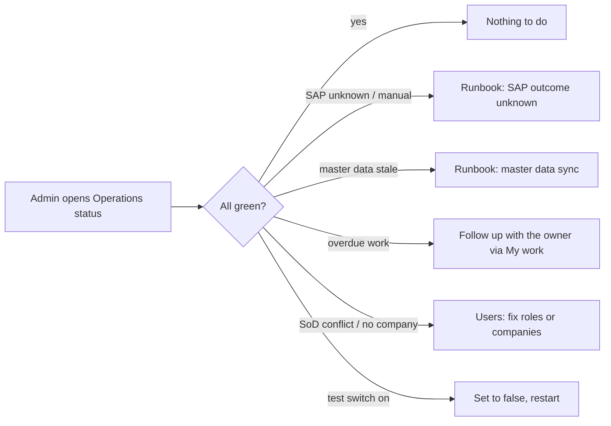

# 25 · Operations status and production readiness (Stage 10)

**Status:** Built 2026-09-25 under the standing instruction "finish all remaining stages": waiting for acceptance. Stage 10 of the Demand-to-PO plan v5. The runbooks, UAT script and checklists are in `docs/operations/`.

## Purpose
This is the administrator's **morning check** in one screen: is SAP answering, is master data fresh, is work overdue, and do any users hold roles they should not hold together. It sits alongside the operating documents needed before go-live.

## Users
Administrators (`operations.open`, in the permission catalogue under Administration; no seeded role gets it).

## Screen: Administration → Operations status
It refreshes every minute, and **Check now** refreshes it at once. Each card has a green tick or an amber warning.

- **Test switches:** a red or amber banner when `ALLOW_VIEW_AS` or `ALLOW_TEST_LOGIN` is on. Both must be off on the live server, and the server refuses to start with them in production.
- **SAP outbox:**
  - counts of waiting, sending, *outcome unknown* and *needs a person*
  - the oldest waiting item
  - the last call to SAP
  - whether SAP is the stub
  - a link to the PO drafts
- **Master data from SAP:** the last successful materials, suppliers and purchase-order syncs. Each is *fresh* or *older than n h*, where *n* is the workflow setting; stale master data blocks PO submission.
- **Overdue work:** open My work items past their due time, per type (task or exception), with the oldest due date.
- **Users and roles:**
  - **Separation of duties** lists active non-admin users holding a conflicting pair:
    - submit + accept demands
    - award + accept the handoff
    - hand off + build the PO
    - raise + decide the same kind of change request
  - **Users with roles but no company**: they would see nothing.
- **Attachments stored:** the number of files and MB, with a reminder to back up the folder with the database.

## Enforced in the server (security review 2026-09)
The review turned into these rules:
- **Separation of duties:**
  - Whoever created a demand cannot accept it.
  - Whoever handed off cannot accept the handoff.
  - Nobody decides their own change request (Stage 2).
  - Administrators are excepted.
- **Delegated administration:** a non-admin with users or roles permissions can only give what they hold. That means no administrator role, no key they lack, never themselves, and never to an administrator. They cannot give companies they do not work for.
- **Connection settings:** a saved AD or SAP password is never reused for a new server address or account.
- **Production start:**
  - It refuses the test switches.
  - It refuses the SAP stub unless `ALLOW_SAP_STUB=true`.
  - Unsaved AD settings check certificates in production.
- **Errors and headers:**
  - The public health check no longer returns database error text.
  - Every reply carries `nosniff`, `X-Frame-Options: DENY`, `Referrer-Policy` and `COOP` headers.

## Negative authorization (plan §10.3)
The DB test *"negative authorization"* (`apps/api/test/db/po.spec.ts`) signs in a user who holds **every permission** but works for another company. It calls 34 procedures through the real tRPC router: demand, RFQ, award, handoff, PO and reports, covering reads, writes, threads and attachments. **Every call answers Not found**, the lists leave the records out, and nothing changes.

## Process flow

## Loose-end check
| Case | Outcome |
|---|---|
| SQL Server 2016 | No `STRING_AGG`: grouping is done in TypeScript (DB test). |
| An admin user holds conflicting keys | Not listed. Admins are trusted and hold everything by design. |
| No syncs ever ran | Each source shows *never*, stale. |

## Out of scope
- Alerts by e-mail or Teams (with Stage 9 notifications)
- Load test
- Malware scan of attachments

These are listed in the backlog.
