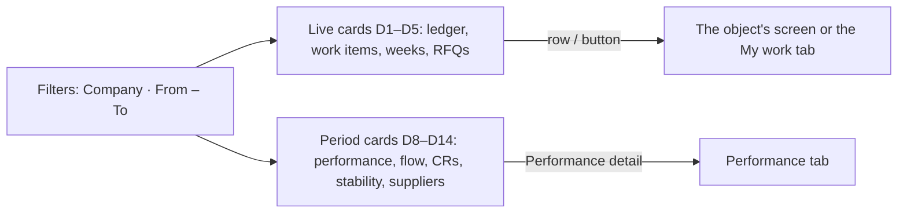

# 26 · Reports → Dashboard (first tab)

**Status:** Built 2026-09-26 from the candidate mockup `docs/mockups/reports-dashboard.html` (16 cards offered, the user chose these 10): waiting for acceptance.

## Purpose
One tab that answers, for the companies you work for, *where the quantity is, who is holding it up, what ships soon and is not sourced, and how the period went* — without opening five lists. It opens first when Reports is opened. A card is on this page only if someone changes what they do after seeing it.

## Users
Sales, Procurement and the PO team (`reports.open`, like the other report tabs). Each user sees only their own companies.

## Screen: Purchasing → Reports → Dashboard
- The tab is first and opens by default (`/reports`, `?tab=dashboard`). The three existing tabs (spec 24) are unchanged.
- The header filters are shared by all tabs. New: a **Company** multi-select (it also narrows the other three tabs). The search does not apply to the dashboard: the box is disabled on this tab with the hint "No search on this tab".
- Cards marked **now** are live: refreshed every minute while the page is open, and the dates do not apply.
- Cards marked **period** follow **From – To**. With no dates they show the **last 12 ISO weeks** (this week and the 11 before), and a line says so. This keeps the heaviest query (performance, spec 24) bounded.
- Every chart has a **Chart | Table** switch; values show on hover; a legend sits under every multi-series chart. Each SVG chart has an accessible name and description (`<title>`/`<desc>`, `aria-labelledby`); chart text follows the app font setting (antd `fontSizeSM`), never a fixed pixel size; the horizontal bars' label and value columns shrink on narrow cards.
- Charts use the Demands list's five progress colours (spec 21) for the quantity classes, one hue for a single measure, and a validated blue/orange pair for the two-series flow chart.

## The cards
| # | Card | Mode | Answers | Source |
|---|---|---|---|---|
| D1 | **Where the quantity is** | now | Per unit, the quantity of demands still in progress (accepted, not closed) by class: on PO, awarded (incl. handed off and PO preparation), in RFQ or quoted, open, cancelled | `scm.QtySlice` by state, grouped like the Demands list progress bar |
| D2 | **Who has the ball** | now | Open work items of the companies by step: open, overdue, oldest; grouped by the **roles that hold the item's permission** (Sales, Procurement, PO team; administrators when no role does), exceptions last. A row opens that My work tab | `scm.InboxItem` open rows × `app.RolePermission` / `app.Role` (non-admin roles) |
| D3 | **Shipping soon — containers per ETD week** | now | The next 10 ETD weeks: containers ordered (behind a CREATED PO), awarded (not yet ordered), in RFQ, open; the version-1 baseline as a tick; weeks inside the aging window with open containers in red | `scm.DemandWeek` (now), `scm.AwardShipment` + `PoDraft` (awarded / ordered), `DemandVersion` 1 (baseline), slices per `ApprovedEtdWeek` (shares) |
| D4 | **Not yet sourced, shipping soon** | now | Open quantity whose ETD week is within `agingWeeksBeforeEtd` — the same rule as the *Open quantity near ETD* exception; totals per unit; the 10 nearest lines with days to the Monday of the week | Open slices, like `modules/rfq/aging.ts` |
| D5 | **RFQs out, waiting for quotes** | now | Sent RFQs where an invited supplier has no current quote and quantity is still to quote: days out, *n of m* quoted, containers and weeks; red when the *Record quotes* item is overdue | `scm.Rfq` (Sent) × `RfqSupplier` × `SupplierQuote` (current) × `InboxItem` |
| D8 | **Headline KPIs, per unit** | period | Committed, executed, outstanding, execution rate, not-sourced rate, on time, accepted → PO created — the Performance tab's headline, with *n* (demands measured) beside each rate | the existing `reports.performance` |
| D10 | **Flow in and out** | period | Containers **as accepted** vs containers ordered (PO created) per ISO week, and the backlog now (containers of demands in progress not yet ordered) | The baseline snapshot (`DemandVersion` = `BaselineVersion`, set on the first acceptance) by `AcceptedAt` week — a later change or merge does not rewrite past weeks; a demand without a baseline counts its current `DemandWeek` containers. Shipments behind CREATED drafts by `SapCreatedAt` week |
| D11 | **Change requests** | now + period | Waiting for Sales / for Procurement to decide with the oldest; blocked at pre-check; decided in the period with the average response per department; the reasons Sales changes demands and the reasons Procurement asks for changes (not sourced, added quantity, week shift, mix change), with *counts against Procurement* marked | `scm.ChangeRequest` × `scm.ReasonCode` |
| D12 | **Demand stability** | period | For demands accepted in the period: how many changed afterwards (a version after the baseline whose reason is not a submit or resubmit), merges; per unit: committed, cancelled by Sales or a change (with the rate), not sourced, added by Procurement, merged in | `scm.Demand`, `DemandVersion`, slices |
| D14 | **Top suppliers** | period | Containers awarded in the period (active shipments of award batches created in it), share per supplier, handoffs **returned by the PO team** (`ReturnedBy` set, as on Performance) per supplier; the top 6 and *Other suppliers (n)* | `AwardShipment` × `AwardBatch` × `md.Supplier` × `Handoff` |

## Rules
| Rule | Detail |
|---|---|
| Scope | Company scope on every query (`scope()` shared with spec 24). Another company's data never appears (DB test). |
| Units | Never added across units. Containers are the only unit-free measure and the only thing summed across demands. |
| N/A | Any ratio with a zero denominator. |
| In progress | A demand counts as in progress while any slice is Open, In RFQ, Quoted, Awarded, Handed off, PO preparation or PO submitted. |
| D3 estimate | Ordered and awarded are the real shipment counts. Containers not yet awarded are split between *open* and *in RFQ* by the week's quantity shares, per demand and week — containers are awarded, quantity is sourced. |
| D3 red weeks | Open containers in a week ≤ now + `agingWeeksBeforeEtd` weeks — the spec 18 rule, not "in RFQ". |
| D2 owners | The roles holding the item's permission, read from the role matrix; the label of a change-request item says who raised it. |
| Period default | Last 12 ISO weeks when From – To is empty. `flow` returns exactly the weeks of the range. |
| Refresh | Live cards every 60 s (like My work's badge); period cards on load and when the filters change. No skeleton on refetch: the previous numbers stay until the new ones arrive, with a small **Updating…** tag in the card title meanwhile. |

## Process flow

## Loose-end check
| Case | Outcome |
|---|---|
| No company assigned | Every card is empty (the shared scope answers "none"). |
| Two units in a demand | Two rows on D1, D8, D12; the container cards do not care. |
| A week only reached by a shift or a merge | D3 still shows its shipments (awarded / ordered); its baseline is "—". |
| A change request withdrawn | Out of the reasons; never in the waiting counts. |
| A supplier no longer in SAP | D14 shows its code as the name. |
| API down | The card shows the error; the others keep working. |
| Slow period | The default is 12 weeks; a year of history is a deliberate choice of dates. |

## Data
- No tables, no migration: `apps/api/src/modules/reports/dashboard.ts`, nine procedures under `reports.dashboard.*` (all `reports.open`), plus the existing `reports.performance` for D8.
- UI: `pages/reports/DashboardTab.tsx` (live cards), `DashboardPeriod.tsx` (period cards), `dashboardParts.tsx` (card frame, period default), `components/Charts.tsx` (stacked bar, columns, horizontal bars, legend — plain SVG, no library).
- Tests: `apps/api/test/db/po.spec.ts` (shapes, company scope, negative authorization), `e2e/stage-8.spec.ts` (the tab opens first, the cards render).

## Out of scope
- The six cards not chosen from the mockup: PO pipeline (D6), where the time goes (D9), handoff quality (D13), containers by origin (D15), awarded and ordered value (D16), price vs last purchase (D17). The mockup keeps them for later.
- Drill-down links that open the Demands list **pre-filtered** (by status or ETD week): the list has no URL filters yet — backlog 37. Rows on D2, D4 and D5 open their My work tab, demand or RFQ directly.
- Excel export of the dashboard (the three report tabs export).
- Personal "my" tiles, sign-in statistics, master-data counts, SAP outbox internals, any total across units or currencies — deliberately not offered (see the mockup's last section).

Mockup: `docs/mockups/reports-dashboard.html`.
