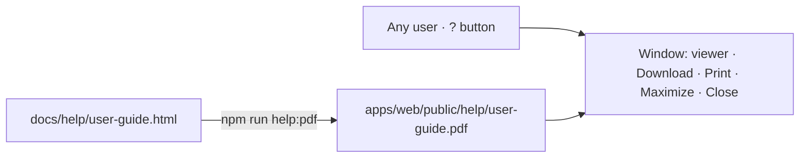

# 27 · Help: the user guide

**Status:** Built 2026-09-26 (asked by the user the same day): waiting for acceptance.

## Purpose
Every user can open, read, print and download **one guide** that explains how the application works: the process flow with its rules, every step with its owner, and the change request cycle with worked examples. The guide is a PDF generated from a source document kept with the code, so it can be regenerated whenever a screen changes.

## Users
Everyone signed in. No permission (it is part of using the app, like the theme); nothing in the guide is company-specific.

## Screen
- **Header:** a **?** button (tooltip *User guide*) beside the user's name, left of the user menu.
- **Window** (a modal over the current page), title *User guide* with four controls:
  - **Download** — saves `Supply-Chain-user-guide.pdf`.
  - **Print** — prints the PDF (the browser's print dialog; if the viewer refuses, the PDF opens in a new tab to print from there).
  - **Maximize / Restore** — the window fills the browser, or goes back to its 1000 px width.
  - **Close** — the window's ×, or Esc.
- The PDF is shown by the browser's own viewer inside the window (`/help/user-guide.pdf`).

## The guide
| Page | Content |
|---|---|
| 1 (landscape) | The **process flow**: four lanes (Sales, Procurement, PO team, System/SAP), the twelve steps with the quantity state each one produces, the change-request box with its holds and automatic returns, the My work box, the quantity ledger strip, and the fourteen rules R1–R14 in a side panel. |
| 2 | **The full cycle step by step**: a table of the twelve steps with owner, what happens and the rules, where it is done and the My work item; plus what can happen at any time (change requests, merge, release, un-award) and how My work works. |
| 3 | **Change requests**: why, who can start what (six request types with who decides and where they start), the seven-step cycle (raise, pre-check, holds, decide item, apply all-or-nothing, follow-ups), and how Procurement responds to a Sales request. |
| 4 | **Six worked examples**: customer reduced the order; cancel a week already handed off; not sourced with approve-less; a supplier offers more (add quantity); week shift; three blocked requests. The reason codes. |
| 5 | **Statuses** (demand, RFQ, award, handoff, PO draft: who has it, what is next) and **the rules R1–R14** in full. |

## Rules
| Rule | Detail |
|---|---|
| Source of truth | `docs/help/user-guide.html`. Change it, then `npm run help:pdf` regenerates `apps/web/public/help/user-guide.pdf` with the headless browser (Edge). Both files are committed. |
| Kept in step | A spec that changes a rule or a step also changes the guide (the same session). |
| Served | As a static file by Vite in development and by the API in production (`SERVE_WEB`), so it needs no procedure and no permission. |
| Wording | The guide uses the screens' own wording (spec 21 statuses, My work item names, reason descriptions). |

## Process flow

## Loose-end check
| Case | Outcome |
|---|---|
| The PDF is missing on a server | The window shows the browser's "not found" page; regenerate with `npm run help:pdf` and rebuild. The e2e test checks the file is served. |
| A browser without a PDF viewer | The Download button still works; Print opens the file in a new tab. |
| Print blocked inside the frame | Falls back to opening the PDF in a new tab. |
| View as | The guide is the same for every role. |

## Data
- No tables, no procedure. Files: `docs/help/user-guide.html`, `apps/web/scripts/help-pdf.mjs`, `apps/web/public/help/user-guide.pdf`, `apps/web/src/components/HelpButton.tsx`; the root script `help:pdf`.
- Test: `e2e/help.spec.ts`.

## Out of scope
- An Arabic edition, or a guide per role.
- Context help per screen (a "?" on each page).
- Editing the guide inside the app.
