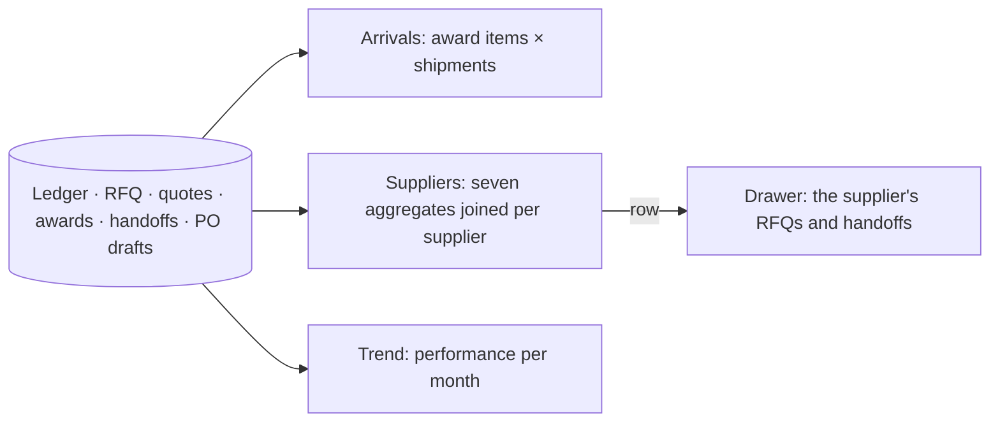

# 28 · Reports: Arrivals, Suppliers, Trend (three new tabs)

**Status:** Built 2026-09-26 from the report review (`docs/review/2026-09-26-report-candidates.md`, candidates S1, P1 and M1, chosen by the user): waiting for acceptance.

## Purpose
Three questions the existing reports could not answer: **what is coming** (Sales), **which suppliers to invite, award and watch** (Procurement), and **are we getting better** (management). All three read the same ledger, RFQ, award, handoff and PO tables; no report table is added.

## Users
Sales, Procurement and the PO team (`reports.open`). Company scope on every query.

## Screen: Purchasing → Reports
The tab row is now: Dashboard · **Arrivals** · Demand execution · Change request register · Performance · **Suppliers** · **Trend**. The header filters apply to all: Company, the search, From – To. The search box says what it matches on each tab — Arrivals: demand, supplier, material or SAP PO; Suppliers: supplier name or code; Trend: **no search** (disabled with a hint; the trend covers everything of the companies and dates). Every tab exports to Excel, with an *About this export* sheet (spec 24).

### Arrivals (S1)
One row per **awarded material** (award item) with its shipment: ETD week (with the Monday), confirmed ETD, company, demand, award, supplier, material, SKU(s) allocated, quantity and unit, price, value, containers of the shipment, **status** (Awarded · Handed off · PO being prepared · Sent to SAP · PO created), handoff, PO draft and SAP PO number, each linked to its page.
- The dates filter on the **ETD week**; with no dates the report starts at the **current week** and runs to the end (what is coming).
- The line above the table totals shipments, containers, quantity per unit and value per currency.
- The search matches the demand, supplier, material, SKU or SAP PO.
- Containers belong to the shipment (supplier × week) and repeat on each of its materials; the total counts each shipment once.

### Suppliers (P1)
One row per supplier that was invited, awarded or handed off in the period (the **last 12 months** when no dates are picked):
- **Invited · Quoted (rate) · Quotes · First contact** — RFQs sent in the period; a supplier counts as quoted when it has at least one current quote on that RFQ.
- **First quote after** — average hours from the RFQ's Sent to the **first quote recorded** in the app for that supplier, over every quote row (current and replaced), so a revision never moves it. It is when Procurement entered the quote, not when the supplier sent it.
- **Cheapest** — rows (RFQ × week × material key × currency) where at least two suppliers quoted, and how often this supplier was the cheapest. Prices are compared only within one currency.
- **Containers · Awards · Value** — active shipments of award batches created in the period; value per currency, never converted.
- **Above offer · Un-awarded · SKU corrections** — from the award change logs.
- **Handoffs · Returned (rate) · SKU issues · POs created** — handoffs sent in the period.
- **Blocked** tag when SAP blocks the supplier for purchasing; **Last award**.
- Click a supplier: a drawer with its RFQs (sent, first quote, containers awarded, first contact) and its handoffs (status, return reason, SAP PO).

### Trend (M1)
The Performance headline **per month of acceptance** (the last 12 months when no dates are picked). With dates, the first and last month are **cut to the exact From / To dates** (a partial month is labelled with its days, e.g. "15–31 Jan 26"). A period longer than 24 months shows the **latest 24 months, ending at To**, and a warning says so. Rates show *n* (demands measured): accepted demands, committed, executed, outstanding, execution rate, not-sourced rate, on time, accepted → PO created, the five stage times, the handoff return rate and the SAP first-reply rate. Per unit, chosen with a switch. Two charts (the three rates; accepted → PO created in days) and the full table. A month's figures cover the demands accepted in it, however far they have come since, so recent months read lower.

## Rules
| Rule | Detail |
|---|---|
| Scope and units | As spec 24: company scope, never across units or currencies, N/A on a zero denominator. |
| Arrivals status | The furthest state of the item's quantity on the ledger; the open handoff and its live PO draft supply the numbers. |
| Price position | Ranked by unit price within RFQ × week × material key × currency; a row with one quote is not compared. |
| Periods | Arrivals: ETD week from the current week. Suppliers: 12 months by the RFQ sent, award and handoff dates. Trend: 12 months of acceptance; partial first/last months; at most the latest 24 (`trendMonths` in `modules/reports/pure.ts`, unit-tested). |
| Speed (2026-09-26) | The trend fetches the whole range once (execution rows, slice milestones, handoff / SAP / accepted counts grouped by month) and splits it by month in code, with the same headline function as Performance (`headlineOf`). It first ran Performance once per month: ~12 s; now ~0.3 s, and identical month by month (checked by `apps/api/src/scripts/timeReports.ts`). Report queries are sent unbatched (`splitLink` in `main.tsx`), so a slow report never holds back the others. |
| Paging | The tables page in the browser like the other report tabs; the queries are bounded by the period and the company. |

## Process flow

## Loose-end check
| Case | Outcome |
|---|---|
| A supplier no longer in SAP | Its code stands in for the name. |
| A shipment without a confirmed ETD | Arrivals shows "—" for the date; the week still sorts it. |
| A handoff returned after an award | Arrivals shows the item as Awarded again, no handoff or PO. |
| Only one supplier quoted a row | Not counted in "cheapest" (nothing to compare). |
| No quantity of a month reached a PO | The month's rates show; accepted → PO created is N/A and the line has a gap. |
| More than 24 months picked | The latest 24 (ending at To) are shown, with a warning. |
| An impossible date or From after To | Refused (400) with a message; nothing runs. |
| Another company | Nothing of it in any tab (DB test). |

## Data
- No tables. `apps/api/src/modules/reports/insights.ts` (`arrivals`, `suppliers`, `supplierDetail`, `trend`), four procedures on `reports.*`.
- UI: `pages/reports/ArrivalsTab.tsx`, `SuppliersTab.tsx`, `TrendTab.tsx`; `components/Charts.tsx` gains `Lines`.
- Tests: `apps/api/test/db/po.spec.ts` (rows, scope, negative authorization), `e2e/stage-8.spec.ts`.

## Out of scope
- The other candidates of the review (backlog 39).
- Currency conversion (a rate table would be its own decision).
- Delivery performance and quality (no goods-receipt data).
