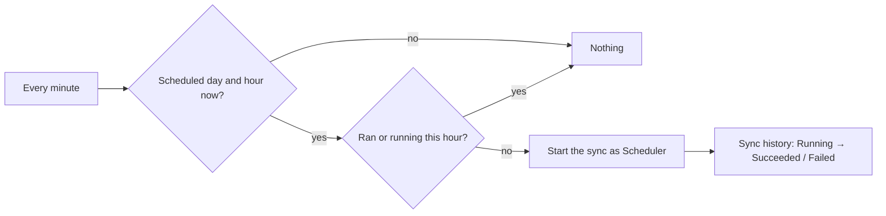

# 30 · Sync schedule (Configuration → SAP)

**Built 2026-09-27 at the user's request.** Each SAP sync can run by itself on chosen days and hours.

- **Where:** Configuration → SAP → **Sync schedule** (anyone with `configuration.open` sees it; changing it needs `configuration.sync.schedule.edit`, audited as `config.sync.schedule`).
- **Per source** (materials, suppliers, purchase orders): on/off, days (Sun … Sat, shortcuts *Sun–Thu* and *Every day*) and hours (00:00 … 23:00). Times are **Saudi time (UTC+3)**. The card shows the next planned run.
- **What runs:** exactly what the source's Sync button does (`modules/sync/jobs.ts`): the chosen material types; the chosen supplier groups; purchase-order *changes since the watermark*. "Re-sync everything" and the fresh copies stay manual.
- **How:** a timer in the API checks every minute (`runScheduledSyncs`, `modules/sync/schedule.ts`). In a chosen hour it starts the sync once, as an ordinary run in the sync history started by **Scheduler**. It is skipped when that source already ran (by hand or schedule) or is running in that hour, and while Start over runs. A refused start (e.g. no groups chosen) is logged once per hour, not retried every minute.
- **Out of scope:** minutes other than :00, per-company schedules, e-mail on failure (the Operations status page shows failed syncs).

