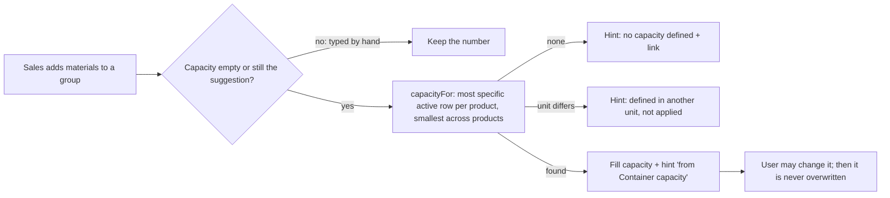

# 32 · Container capacity (Configuration → Workflow)

**Built 2026-09-29 at the user's request:** "Define the maximum payload (container capacity) per container for each product, and Capacity per container in a new demand adapts the value from the predefined values."

- **Where:** Configuration → Workflow → **Container capacity**. Anyone with `configuration.open` sees the list (read-only); adding, editing, switching active and removing need `configuration.workflow.capacity.edit` (audited as `config.workflow.capacity`, `…capacity.active`, `…capacity.delete`). Table `scm.ContainerCapacity` (migration 0034).
- **A row:** Major category (required) · Sub-major (or *any*) · Size (or *any*; only with a sub-major) · Capacity per container (1 – 99,999) · Unit (CT, KG, BOX …; units seen on SAP materials are offered, any 1–10 letters/digits allowed) · Active. One row per major / sub-major / size. Choices come from the materials in SAP; Sub-major depends on Major, Size on Sub-major.
- **Matching (`modules/workflowSetup/capacityMatch.ts`):** per product of a container group, the most specific **active** row wins: major + sub-major + size, then major + sub-major, then major. A product with *any size* on the demand matches only rows for any size. A group of several products takes the **smallest** capacity (a mixed container is limited by its most restrictive product). Products without a row do not limit the group but are named in a note; if the matched rows have different units, the unit of the smallest is used, with a note. Nothing matches → no default.
- **Demand editor (spec 12):** when materials are added to a container group and its capacity is empty or still holds the last suggested number, the capacity is filled in from here (`workflowSetup.capacityFor`, permission `demands.open`) and the field shows "from Container capacity (Apples Royal Gala)". Nothing defined → "no capacity defined for these products", with a link to this section for users who may edit it. A number typed by hand is never overwritten. If the capacity row's unit differs from the group's unit, the number is not applied and the hint says so. The suggestion lives in the editor only: the saved demand carries its own number, so changing or removing a row never changes an existing demand. The same applies to new groups in the change request editor, which uses the same group card.
- **Removing** a row deletes it (nothing refers to it); switching it inactive keeps it for later.
- **Out of scope:** capacity per supplier, per container type or per origin; recalculating saved demands.

